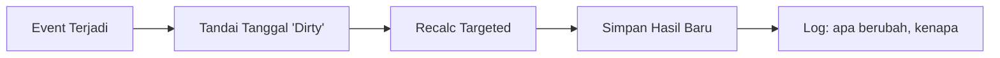

# ⚙️ Architecture Principles — OrcaHR

> Prinsip arsitektur inti. Dokumen ini bukan tentang teknologi. Ini tentang **cara berpikir**.
>
> _"Bangun sistem yang bisa menjelaskan masa lalunya sendiri."_

---

## Mental Model

Attendance engine **bukan fitur absensi**. Ia adalah:

| Analogi | Fungsi |
|---|---|
| 🔧 **Compiler** | Mengambil input mentah, menerapkan aturan, menghasilkan output terstruktur |
| 📋 **Mesin Audit** | Setiap keputusan bisa dilacak: siapa, kapan, berdasarkan aturan apa |
| 📒 **Ledger Perilaku Kerja** | Catatan permanen yang tidak bisa diubah tanpa jejak |

Dunia nyata penuh dengan:
- Request telat, approval mundur
- Schedule berubah, cuti retroaktif
- Lupa clock-in, lembur tidak tercatat

**Sistem yang baik tidak menolak realitas itu. Ia mengelolanya secara deterministik dan bisa dilacak.**

> [!IMPORTANT]
> Kalau suatu hari ada sengketa: _"Kenapa OT saya berubah?"_
>
> Sistem harus bisa menjawab: _"Karena approval ID X pada tanggal Y, dihitung ulang pada timestamp Z, dengan policy yang berlaku saat itu."_
>
> Itu level HRIS yang dewasa.

---

## Prinsip 1: Pisahkan Fakta, Aturan, dan Hasil

> Prinsip paling krusial. **Jangan pernah campur ketiga layer ini.**

```
┌─────────────────────────────────────────────────────────┐
│  LAYER         │  CONTOH                │  SIFAT        │
├─────────────────────────────────────────────────────────┤
│  Raw Data      │  Clock log             │  IMMUTABLE    │
│  (Fakta)       │  Leave request         │  Saksi        │
│                │  Approval record       │               │
├─────────────────────────────────────────────────────────┤
│  Rules         │  Schedule / shift      │  VERSIONED    │
│  (Aturan)      │  Policy (toleransi     │  Konteks      │
│                │    telat, rule OT)     │               │
│                │  Effective date        │               │
├─────────────────────────────────────────────────────────┤
│  Result        │  Daily attendance      │  DERIVABLE    │
│  (Hasil)       │  OT minutes            │  Bisa dihitung│
│                │  Status hadir/alpha    │  ulang        │
└─────────────────────────────────────────────────────────┘
```

### Aturan Main

| Layer | Boleh | Tidak Boleh |
|---|---|---|
| **Raw Data** (Fakta) | Append, soft-delete dengan alasan | Edit/hapus tanpa jejak |
| **Rules** (Aturan) | Versi baru dengan effective date | Overwrite aturan lama |
| **Result** (Hasil) | Recalculate dari fakta + aturan | Edit langsung tanpa recalc |

**Clock log itu saksi. Schedule itu konteks. Daily attendance itu hasil penghakiman.**

> [!CAUTION]
> Kalau kamu ubah saksi atau ubah histori hasil tanpa jejak, sistemmu **tidak bisa diaudit**.

---

## Prinsip 2: Effective-Dated Everything

> Semua yang bisa berubah **harus punya tanggal efektif**.

### Yang Harus Punya Effective Date

| Entitas | Contoh Perubahan |
|---|---|
| Schedule assignment | Karyawan pindah shift mulai tanggal X |
| Policy | Toleransi telat berubah dari 15 → 10 menit |
| Rule lembur | Minimal OT berubah dari 1 jam → 30 menit |
| Jabatan | Promosi yang berdampak ke jam kerja |
| Komponen gaji | Tunjangan berubah mulai bulan depan |

### Kenapa Ini Wajib

```
Perubahan tanggal 8 TIDAK BOLEH mengubah perhitungan tanggal 2.
```

- Tanpa effective date, **histori jadi cair**
- Payroll dan audit **benci** hal itu
- Pertanyaan "berapa gaji saya bulan lalu?" harus selalu bisa dijawab **persis**

### Pattern: Effective Date Range

```
employee_schedules:
  ├── employee_id
  ├── schedule_id
  ├── effective_from   ← mulai berlaku
  ├── effective_to     ← null = masih aktif
  └── created_by
```

Saat query tanggal tertentu:
```
WHERE effective_from <= :date AND (effective_to IS NULL OR effective_to >= :date)
```

---

## Prinsip 3: Recalculation = Event-Driven

> **Bukan tombol sakti. Bukan cron job tiap jam.**

### Flow



### Trigger Recalculation

| Event | Dampak |
|---|---|
| Clock log masuk (baru/koreksi) | Recalc hari itu |
| Leave request approved | Recalc hari cuti |
| Overtime request approved | Recalc hari lembur |
| Schedule diubah (effective date) | Recalc hari terdampak |
| Policy berubah | Recalc range terdampak |
| Period di-unlock | Recalc seluruh period |

### Yang Salah vs Yang Benar

| ❌ Salah | ✅ Benar |
|---|---|
| Recalculate semua setiap jam | Recalculate hanya yang terdampak |
| Tombol "Hitung Ulang Semua" | Tombol = masukkan ke antrean, proses targeted |
| Langsung overwrite hasil | Simpan hasil baru + log perubahan |
| Satu function monolitik | Queue job per tanggal/karyawan |

> [!NOTE]
> Tombol "Recalculate" hanyalah **alat admin untuk memasukkan item ke antrean**, bukan mesin utamanya.

---

## Prinsip 4: Lock Boundary untuk Payroll

> **Attendance boleh berubah. Payroll tidak boleh berubah sembarangan.**

### Timeline

```
         Attendance Period              Payroll Period
    ┌─────────────────────┐        ┌──────────────────┐
    │  OPEN               │        │  DRAFT            │
    │  (bisa recalc)      │───────▶│  (bisa adjust)    │
    │                     │        │                   │
    │  LOCKED ─────────── │───────▶│  FINALIZED        │
    └─────────────────────┘        │  (IMMUTABLE)      │
                                   └──────────────────┘
```

### Setelah Period Lock

| Aksi | Boleh? | Cara |
|---|---|---|
| Edit daily attendance | ❌ | Unlock dulu (dengan approval + log) |
| Ubah data payroll | ❌ | Buat **adjustment / backpay** di period berikutnya |
| Rewrite histori payroll | ❌❌ | **Tidak pernah** |
| Lihat histori lama | ✅ | Selalu bisa |

> [!WARNING]
> Kalau tidak ada boundary ini, **laporan keuangan bisa berubah diam-diam**. Itu bukan bug kecil. Itu **risiko hukum**.

---

## Prinsip 5: Auditability

> Setiap perubahan harus menjawab: **siapa, kapan, apa yang berubah, dan kenapa.**

### Audit Trail Pattern

| Field | Isi |
|---|---|
| `action` | created / updated / recalculated / approved |
| `actor_id` | Siapa yang melakukan |
| `timestamp` | Kapan |
| `old_value` | Nilai sebelumnya (JSON) |
| `new_value` | Nilai sesudahnya (JSON) |
| `reason` | Trigger: event ID, approval ID, atau manual |

### Contoh Audit Log yang Bagus

```
"OT karyawan #123 pada 2026-03-01 berubah dari 0 → 120 menit.
 Trigger: Overtime Request #456 approved oleh Manager #789 pada 2026-03-05.
 Recalculated pada 2026-03-05 14:32:07 WIB.
 Policy yang berlaku: OT-POLICY-v3 (effective 2026-01-01)."
```

**Ini level yang harus dicapai.**

---

## Prinsip 6: Security (→ Lihat SECURITY_BLUEPRINT.md)

Keamanan sudah dibahas detail di [SECURITY_BLUEPRINT.md](file:///z:/project/docs/SECURITY_BLUEPRINT.md). Ringkasan:

- Enkripsi field sensitif (NIK, NPWP, rekening)
- Dual-column pattern (encrypted + HMAC hash)
- RBAC ketat (least privilege)
- Encryption at rest + TLS in transit
- Key management terpisah dari DB
- ISO 27001 sebagai fondasi

---

## Ringkasan: 6 Prinsip

```
1. PISAHKAN    → Fakta, Aturan, Hasil — jangan pernah campur
2. EFFECTIVE   → Semua perubahan punya tanggal efektif
3. EVENT       → Recalculate hanya yang terdampak, bukan semuanya
4. LOCK        → Payroll yang final tidak boleh diubah
5. AUDIT       → Setiap perubahan bisa dilacak dan dijelaskan
6. SECURE      → Enkripsi + akses kontrol + logging
```

> _Kalau kamu melihat ini sebagai proyek teknis, kamu sedang membangun software._
> _Kalau kamu melihat ini sebagai sistem kontrol sosial dan finansial, kamu sedang membangun **infrastruktur organisasi**._

---

*Dibuat: 3 Maret 2026*
