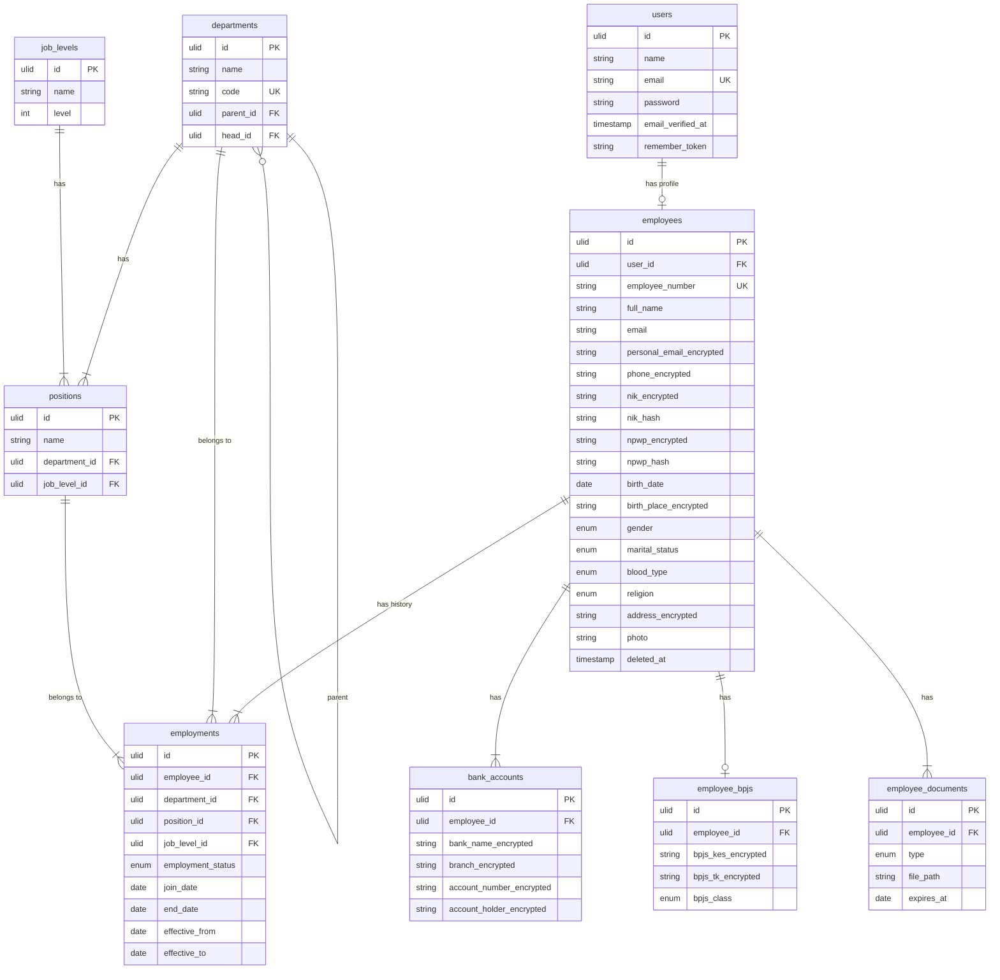
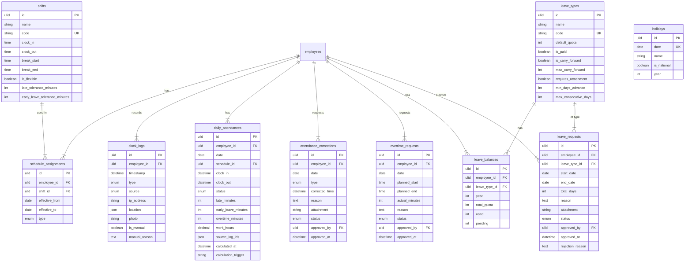
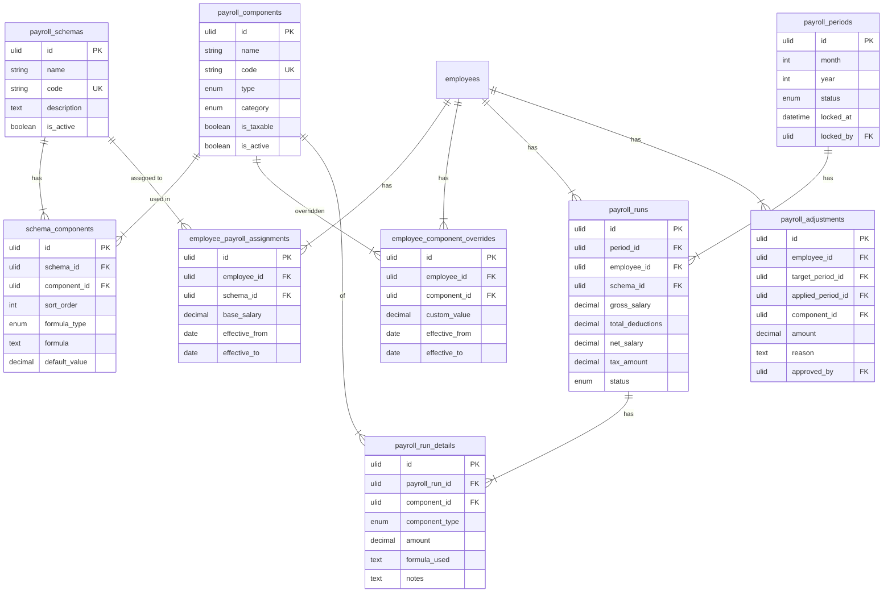
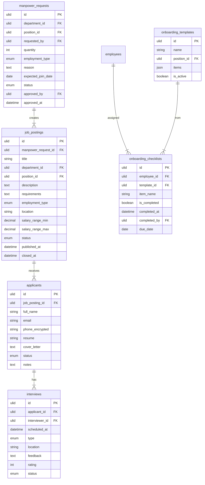
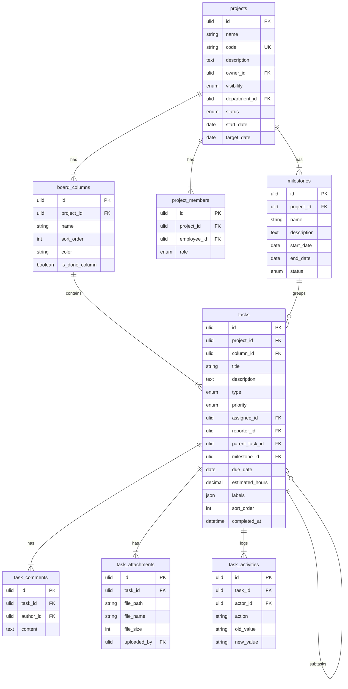
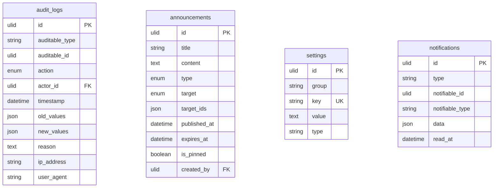

# 🗄️ Database Schema — OrcaHR

> ERD dan detail tabel untuk seluruh modul.
> Database: **MySQL 8**
> Referensi: [Module Specifications](file:///z:/project/docs/MODULE_SPECIFICATIONS.md) · [Security Blueprint](file:///z:/project/docs/SECURITY_BLUEPRINT.md)

---

## Konvensi

| Konvensi | Detail |
|---|---|
| Naming | snake_case, plural untuk tabel |
| Primary Key | `id` (ULID, `char(26)` via `HasUlids` trait) |
| Foreign Key | `{table_singular}_id` (ULID, `char(26)`) |
| Timestamps | `created_at`, `updated_at` pada semua tabel |
| Soft Delete | `deleted_at` pada tabel yang butuh (employees, dll) |
| Encrypted | 🔒 Kolom terenkripsi (AES-256) |
| Hashed | #️⃣ Kolom HMAC hash (untuk search) |
| Effective Date | ⚡ Kolom effective_from / effective_to |

---

## ERD Overview (Core HR)



---

## ERD: Attendance & Leave



---

## ERD: Payroll Engine



---

## ERD: Recruitment & Onboarding



---

## ERD: Project Management



---

## ERD: System (Audit, Announcement, Settings)



---

## Index Strategy

### High-Priority Indexes

| Tabel | Index | Tipe | Alasan |
|---|---|---|---|
| `employees` | `nik_hash` | UNIQUE | Cek duplikat NIK |
| `employees` | `npwp_hash` | INDEX | Matching NPWP |
| `employees` | `employee_number` | UNIQUE | Lookup cepat |
| `employments` | `(employee_id, effective_from, effective_to)` | COMPOSITE | Query effective-dated |
| `clock_logs` | `(employee_id, timestamp)` | COMPOSITE | Query per hari |
| `daily_attendances` | `(employee_id, date)` | UNIQUE | 1 record per karyawan per hari |
| `schedule_assignments` | `(employee_id, effective_from, effective_to)` | COMPOSITE | Query shift berlaku |
| `leave_balances` | `(employee_id, leave_type_id, year)` | UNIQUE | 1 balance per tipe per tahun |
| `payroll_runs` | `(period_id, employee_id)` | UNIQUE | 1 run per karyawan per period |
| `payroll_periods` | `(month, year)` | UNIQUE | 1 period per bulan |
| `tasks` | `(project_id, column_id, sort_order)` | COMPOSITE | Kanban ordering |
| `audit_logs` | `(auditable_type, auditable_id)` | COMPOSITE | Query per record |
| `audit_logs` | `(actor_id, timestamp)` | COMPOSITE | Query per user |

### Soft-Delete Tables

Tabel yang menggunakan `deleted_at`:
- `employees`
- `users`
- `departments`
- `positions`

---

## Migration Order

> Urutan migration berdasarkan foreign key dependency.

```
01. users
02. settings
03. departments
04. job_levels
05. positions
06. employees
07. employments
08. bank_accounts
09. employee_bpjs
10. employee_documents
─── Attendance ───
11. shifts
12. schedule_assignments
13. clock_logs
14. daily_attendances
15. attendance_corrections
16. overtime_requests
─── Leave ───
17. leave_types
18. leave_balances
19. leave_requests
20. holidays
─── Payroll ───
21. payroll_components
22. payroll_schemas
23. schema_components
24. employee_payroll_assignments
25. employee_component_overrides
26. payroll_periods
27. payroll_runs
28. payroll_run_details
29. payroll_adjustments
─── Recruitment ───
30. manpower_requests
31. job_postings
32. applicants
33. interviews
34. onboarding_templates
35. onboarding_checklists
─── Project Management ───
36. projects
37. project_members
38. board_columns
39. milestones
40. tasks
41. task_comments
42. task_attachments
43. task_activities
─── System ───
44. announcements
45. audit_logs
46. notifications
```

**Total: 46 tabel**

---

## Encrypted Columns Summary

| Tabel | Kolom | Encrypted | HMAC Hash |
|---|---|---|---|
| `employees` | `nik` | ✅ `nik_encrypted` | ✅ `nik_hash` |
| `employees` | `npwp` | ✅ `npwp_encrypted` | ✅ `npwp_hash` |
| `employees` | `personal_email` | ✅ `personal_email_encrypted` | ❌ |
| `employees` | `phone` | ✅ `phone_encrypted` | ❌ |
| `employees` | `birth_place` | ✅ `birth_place_encrypted` | ❌ |
| `employees` | `address` | ✅ `address_encrypted` | ❌ |
| `bank_accounts` | `bank_name` | ✅ `bank_name_encrypted` | ❌ |
| `bank_accounts` | `branch` | ✅ `branch_encrypted` | ❌ |
| `bank_accounts` | `account_number` | ✅ `account_number_encrypted` | ❌ |
| `bank_accounts` | `account_holder` | ✅ `account_holder_encrypted` | ❌ |
| `employee_bpjs` | `bpjs_kesehatan` | ✅ `bpjs_kes_encrypted` | ❌ |
| `employee_bpjs` | `bpjs_ketenagakerjaan` | ✅ `bpjs_tk_encrypted` | ❌ |
| `applicants` | `phone` | ✅ `phone_encrypted` | ❌ |

---

*Dibuat: 4 Maret 2026*
*Total tabel: 46*
*Database: MySQL 8 • Single Company*
