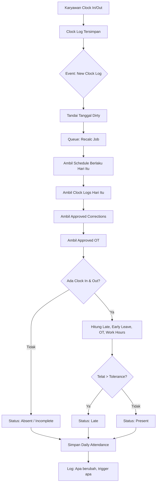
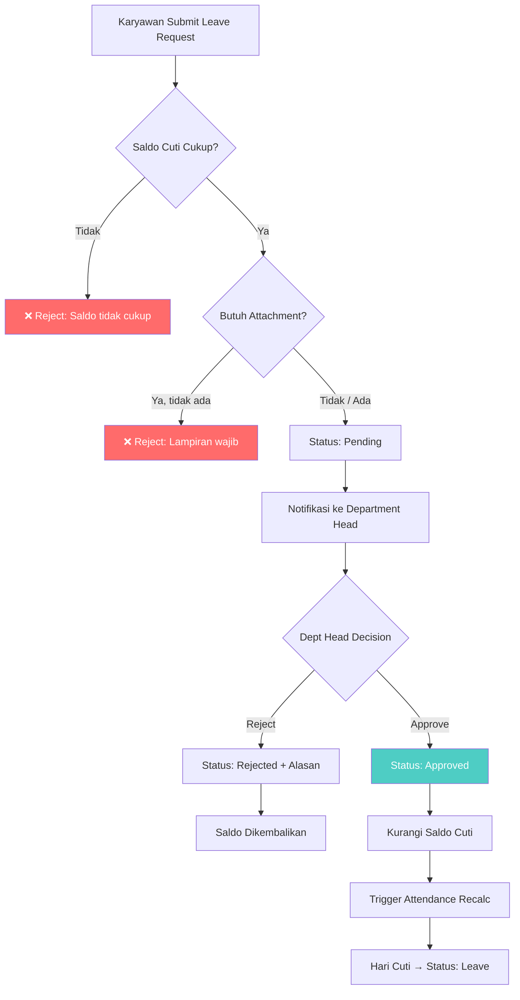
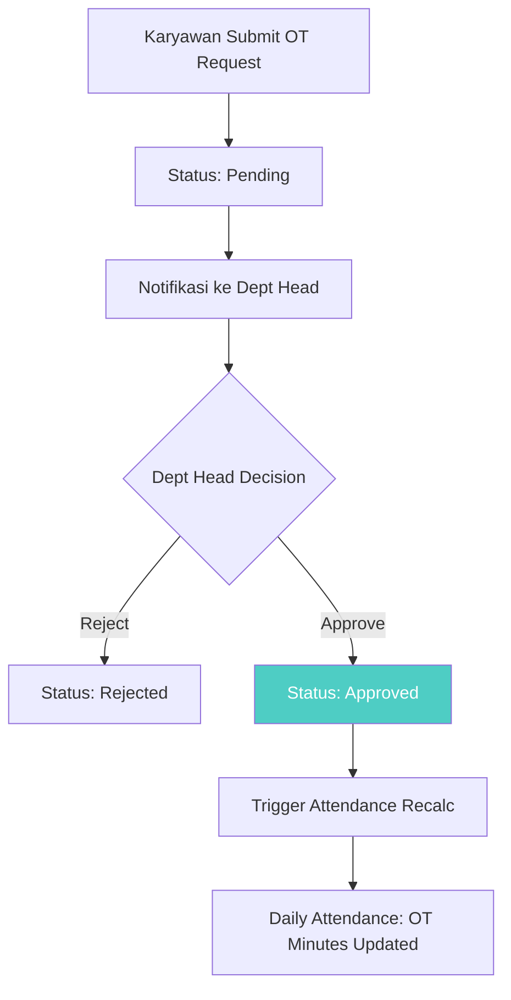
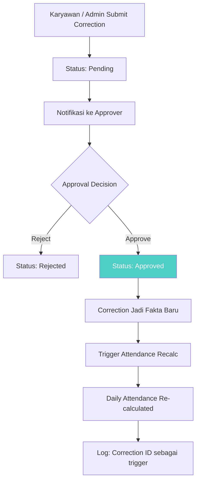
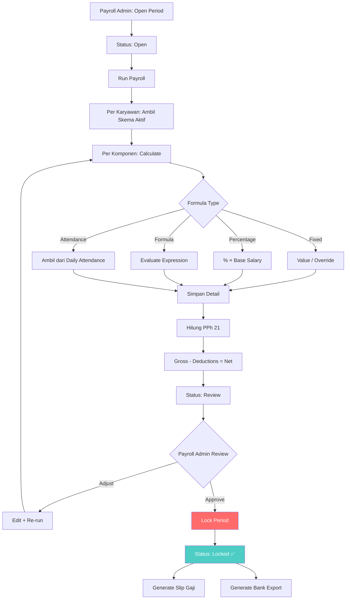
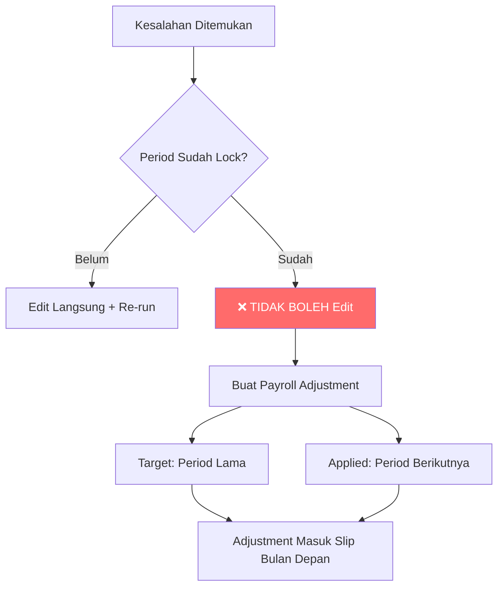
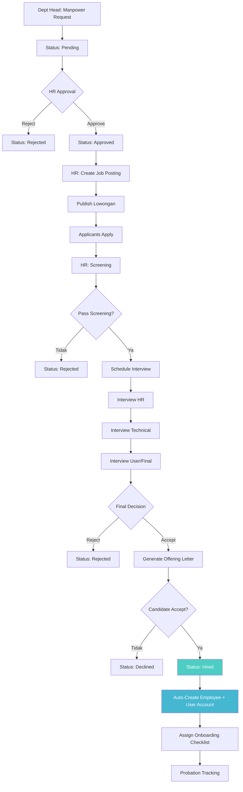
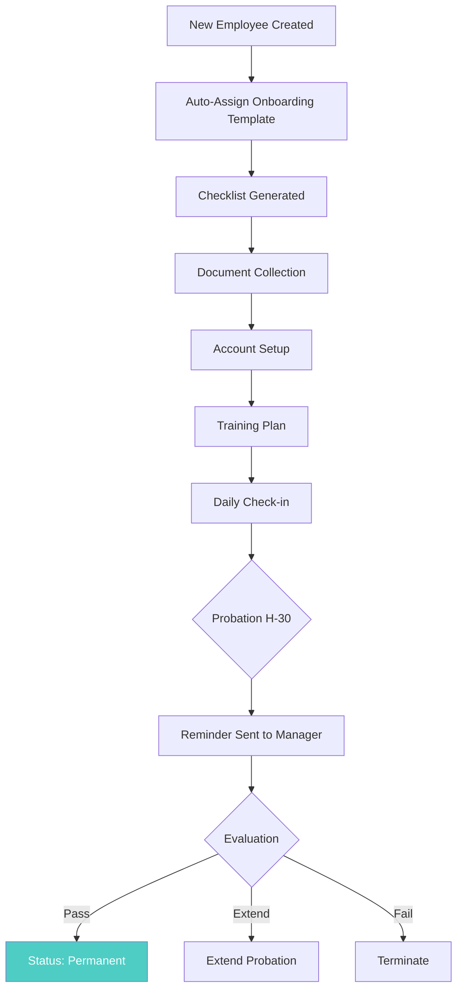
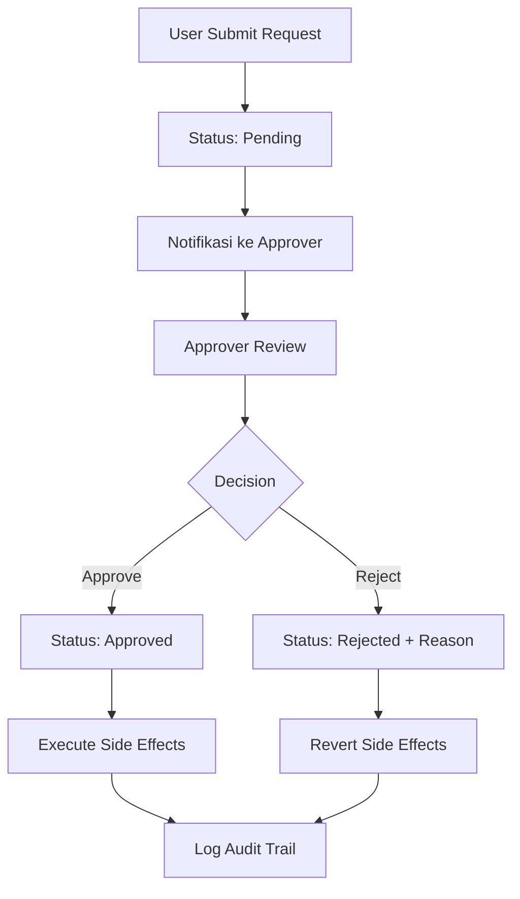

# 📊 Business Process Flowcharts — OrcaHR

> Visualisasi alur proses bisnis utama.

---

## 1. Attendance: Daily Processing

---

## 2. Leave Request & Approval

---

## 3. Overtime Request & Approval

---

## 4. Attendance Correction

---

## 5. Payroll Processing

---

## 6. Payroll Correction (Post-Lock)

---

## 7. Recruitment Pipeline

---

## 8. Onboarding Process

---

## 9. General Approval Flow Pattern

> Banyak modul menggunakan pattern approval yang sama.

**Modul yang pakai pattern ini:**
- Leave Request
- Overtime Request
- Attendance Correction
- Manpower Request
- Profile Update (ESS)

---

*Dibuat: 4 Maret 2026*
