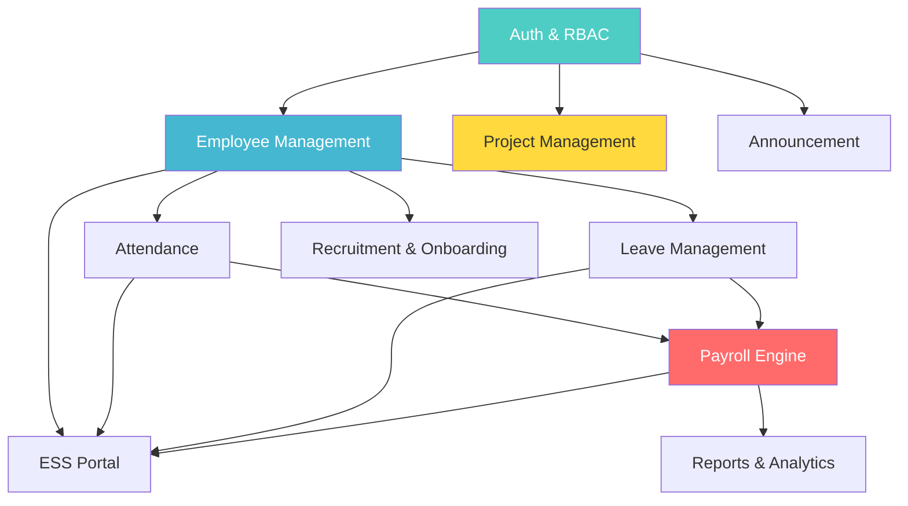
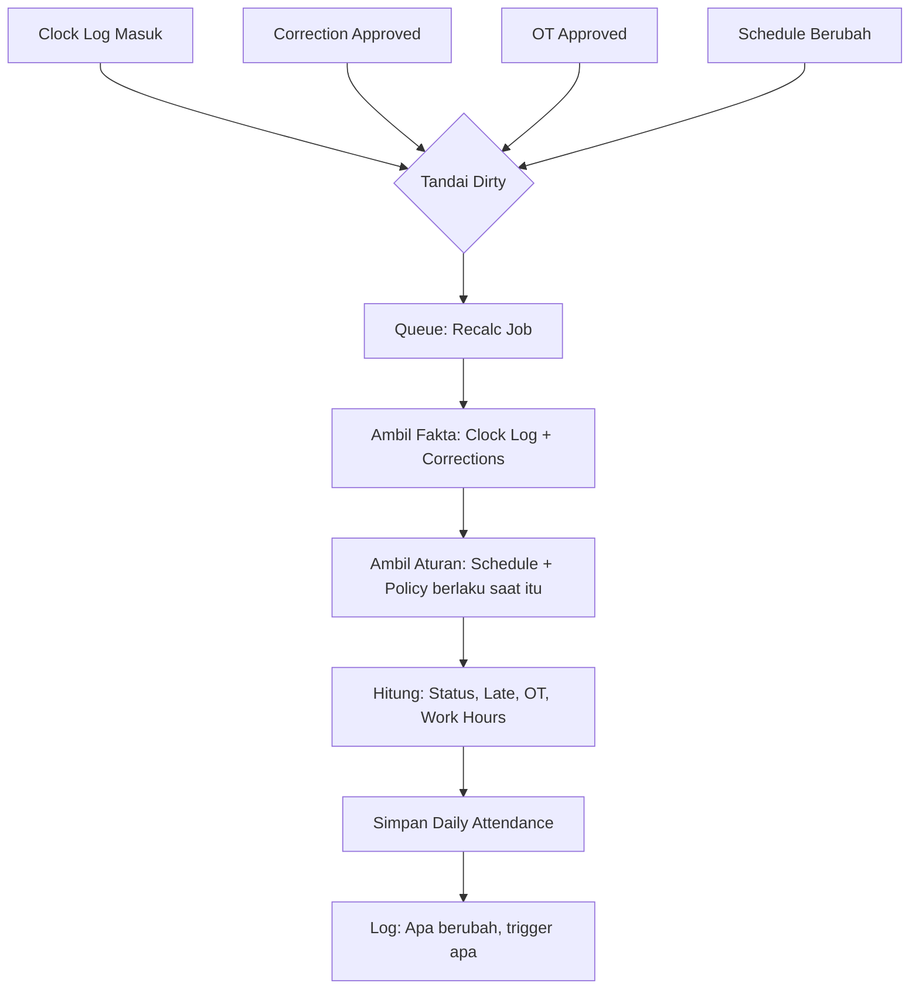
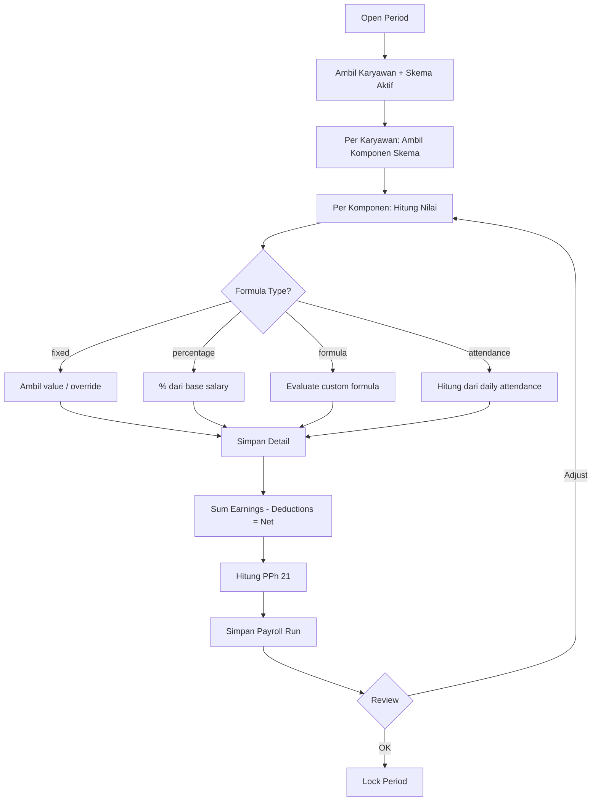
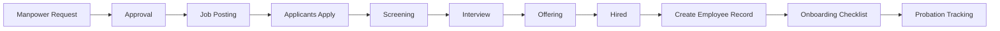

# 📋 Module Specifications — OrcaHR

> Detail setiap modul: tujuan, fitur, entitas, aturan bisnis, dan dependensi.
> Tech Stack: **Laravel 12 + Blade + Alpine.js + Tailwind CSS** • **Single Company (Single-Tenant)**
> Referensi: [Architecture Principles](file:///z:/project/docs/ARCHITECTURE_PRINCIPLES.md) · [Security Blueprint](file:///z:/project/docs/SECURITY_BLUEPRINT.md)

---

## Module Map

---

# Module 0: Foundation

> **Tujuan:** Infrastruktur dasar yang dipakai semua modul.

## 0.1 Authentication

| Item | Detail |
|---|---|
| Backend | Laravel Breeze (auth controllers + routes) |
| Frontend | Custom Blade views (bukan Breeze default) |
| Login | Email + password (session-based) |
| Session | Standard Laravel session (cookie) |
| Remember me | Optional persistent session |
| Password reset | Via email link (Breeze built-in) |
| Brute force protection | Throttle: max 5 attempt / menit |

## 0.2 Role & Permission (RBAC)

### Roles

| Role | Deskripsi | Level |
|---|---|---|
| **Super Admin** | Akses penuh, kelola sistem | 1 |
| **HR Admin** | Kelola karyawan, cuti, attendance | 2 |
| **Payroll Admin** | Kelola payroll, slip gaji | 2 |
| **Department Head** | Approval cuti, lembur tim sendiri | 3 |
| **Employee** | Self-service: profil, cuti, slip gaji | 4 |

### Permission Matrix

| Permission | Super Admin | HR Admin | Payroll Admin | Dept Head | Employee |
|---|---|---|---|---|---|
| Manage users & roles | ✅ | ❌ | ❌ | ❌ | ❌ |
| CRUD employee | ✅ | ✅ | ❌ | ❌ | ❌ |
| View employee list | ✅ | ✅ | ✅ | ✅ (tim) | ❌ |
| View sensitive data (NIK, rekening) | ✅ | ✅ | ✅ (rekening) | ❌ | ✅ (self) |
| Manage attendance | ✅ | ✅ | ❌ | ❌ | ❌ |
| Clock in/out | ✅ | ✅ | ✅ | ✅ | ✅ |
| Approve leave | ✅ | ✅ | ❌ | ✅ (tim) | ❌ |
| Approve overtime | ✅ | ✅ | ❌ | ✅ (tim) | ❌ |
| Submit leave/OT request | ✅ | ✅ | ✅ | ✅ | ✅ |
| Run payroll | ✅ | ❌ | ✅ | ❌ | ❌ |
| View slip gaji | ✅ | ❌ | ✅ | ❌ | ✅ (self) |
| Manage recruitment | ✅ | ✅ | ❌ | ❌ | ❌ |
| Submit manpower request | ✅ | ✅ | ❌ | ✅ | ❌ |
| Project management | ✅ | ✅ | ✅ | ✅ | ✅ |
| View audit log | ✅ | ❌ | ❌ | ❌ | ❌ |
| System settings | ✅ | ❌ | ❌ | ❌ | ❌ |

## 0.3 Dashboard

| Role | Widget |
|---|---|
| Super Admin | Total karyawan, pending approvals, system health |
| HR Admin | Karyawan aktif/nonaktif, cuti hari ini, attendance summary |
| Payroll Admin | Payroll status bulan ini, pending payroll |
| Dept Head | Tim attendance hari ini, pending leave/OT requests |
| Employee | Profil ringkas, saldo cuti, attendance bulan ini, tasks assigned |

## 0.4 Audit Log

> **Dibangun dari Fase 1 (bukan Fase akhir).** Ref: [Architecture Principles #5](file:///z:/project/docs/ARCHITECTURE_PRINCIPLES.md)

### Entitas: AuditLog

| Field | Tipe | Keterangan |
|---|---|---|
| auditable_type | string | Model class (Employee, PayrollRun, etc) |
| auditable_id | integer | ID record yang berubah |
| action | enum | created / updated / deleted / recalculated / approved / accessed |
| actor_id | FK → User | Siapa yang melakukan |
| timestamp | datetime | Kapan |
| old_values | json | Nilai sebelumnya |
| new_values | json | Nilai sesudahnya |
| reason | text | Trigger: event ID, approval ID, manual input |
| ip_address | string | |
| user_agent | string | |

### Aturan
1. Semua perubahan pada data sensitif wajib di-log
2. Akses read pada data terenkripsi (NIK, rekening) juga di-log
3. Retention policy configurable (default 2 tahun)
4. Audit log sendiri immutable — tidak bisa diedit/dihapus

## 0.5 System Settings

- Company profile (nama, logo, alamat)
- Tahun fiskal
- Format tanggal & mata uang
- Email notification settings
- Audit log retention policy

---

# Module 1: Employee Management

> **Tujuan:** Single source of truth untuk semua data karyawan.

## Entitas

### Employee (Master)

| Field | Tipe | Encrypt | Keterangan |
|---|---|---|---|
| employee_number | string | ❌ | Auto-generated, unique |
| full_name | string | ❌ | |
| email | string | ❌ | Login email (company) |
| personal_email | string | 🔒 | Opsional |
| phone | string | 🔒 | |
| nik | string | 🔒 + HMAC | Dual-column pattern |
| npwp | string | 🔒 + HMAC | Dual-column pattern |
| birth_date | date | ❌ | RBAC-protected |
| birth_place | string | 🔒 | |
| gender | enum | ❌ | |
| marital_status | enum | ❌ | |
| blood_type | enum | ❌ | |
| religion | enum | ❌ | |
| address | text | 🔒 | Alamat lengkap |
| photo | file | ❌ | Path ke storage |

### Employment (Effective-Dated)

| Field | Tipe | Keterangan |
|---|---|---|
| employee_id | FK | |
| department_id | FK | |
| position_id | FK | |
| job_level_id | FK | |
| employment_status | enum | permanent / contract / probation |
| join_date | date | |
| end_date | date | null = masih aktif |
| effective_from | date | ⚡ Effective date |
| effective_to | date | null = current |

### Bank Account

| Field | Tipe | Encrypt |
|---|---|---|
| employee_id | FK | |
| bank_name | string | 🔒 |
| branch | string | 🔒 |
| account_number | string | 🔒 |
| account_holder | string | 🔒 |

### BPJS

| Field | Tipe | Encrypt |
|---|---|---|
| bpjs_kesehatan_number | string | 🔒 |
| bpjs_ketenagakerjaan_number | string | 🔒 |
| bpjs_class | enum | Kelas 1/2/3 |

### Employee Documents

| Field | Tipe | Keterangan |
|---|---|---|
| employee_id | FK | |
| type | enum | ktp / npwp / contract / medical / other |
| file_path | string | Encrypted storage + signed URL |
| uploaded_at | datetime | |
| expires_at | date | Untuk kontrak, SIM, dll |

## Organisasi

### Department

| Field | Tipe |
|---|---|
| name | string |
| code | string (unique) |
| parent_id | FK (self) → hierarki |
| head_id | FK → Employee |

### Position

| Field | Tipe |
|---|---|
| name | string |
| department_id | FK |
| job_level_id | FK |

### Job Level

| Field | Tipe |
|---|---|
| name | string |
| level | integer (ordering) |

## Fitur

- [x] CRUD karyawan dengan form multi-step (Vue)
- [x] Upload & manage dokumen (encrypted storage)
- [x] Riwayat jabatan (effective-dated)
- [x] Filter & search (department, status, jabatan)
- [x] Export data karyawan (CSV/Excel)
- [x] Dashboard statistik (aktif, kontrak habis, distribusi dept)

## Aturan Bisnis

1. Employee number auto-generated, format configurable
2. NIK harus unik (validasi via HMAC hash)
3. Perubahan jabatan/department = record baru di employment (effective-dated, bukan overwrite)
4. Kontrak yang akan habis → notifikasi H-30
5. Soft delete only — karyawan tidak pernah benar-benar dihapus

---

# Module 2: Attendance

> **Tujuan:** Merekam fakta kehadiran dan menghasilkan status harian secara deterministik.
>
> _Prinsip: Fakta (clock log) terpisah dari Aturan (schedule) terpisah dari Hasil (daily attendance)._

## Entitas

### Shift

| Field | Tipe | Keterangan |
|---|---|---|
| name | string | Contoh: "Pagi", "Siang", "Malam" |
| code | string | Contoh: "SH-P" |
| clock_in | time | 08:00 |
| clock_out | time | 17:00 |
| break_start | time | 12:00 |
| break_end | time | 13:00 |
| is_flexible | boolean | Jam fleksibel? |
| late_tolerance_minutes | integer | Default: 15 |
| early_leave_tolerance_minutes | integer | Default: 0 |

### Schedule Assignment (Effective-Dated)

| Field | Tipe | Keterangan |
|---|---|---|
| employee_id | FK | |
| shift_id | FK | |
| effective_from | date | ⚡ |
| effective_to | date | null = current |
| type | enum | fixed / rotating |

### Clock Log (Raw Data — IMMUTABLE)

| Field | Tipe | Keterangan |
|---|---|---|
| employee_id | FK | |
| timestamp | datetime | Waktu aktual |
| type | enum | clock_in / clock_out |
| source | enum | web / mobile / device / manual |
| ip_address | string | |
| location | json | lat, lng (opsional) |
| photo | string | Selfie (opsional) |
| is_manual | boolean | Input manual oleh admin? |
| manual_reason | text | Wajib jika is_manual |

> [!CAUTION]
> Clock log **tidak boleh diedit atau dihapus**. Kalau salah, buat record koreksi baru (Attendance Correction).

### Daily Attendance (Result — DERIVABLE)

| Field | Tipe | Keterangan |
|---|---|---|
| employee_id | FK | |
| date | date | |
| schedule_id | FK | Schedule yang berlaku hari itu |
| clock_in | datetime | Dari clock log |
| clock_out | datetime | Dari clock log |
| status | enum | present / late / early_leave / absent / leave / holiday |
| late_minutes | integer | Dihitung dari schedule |
| early_leave_minutes | integer | Dihitung dari schedule |
| overtime_minutes | integer | Dari approved OT request |
| work_hours | decimal | Total jam kerja |
| source_log_ids | json | Referensi ke clock_log IDs |
| calculated_at | datetime | Kapan terakhir dihitung |
| calculation_trigger | string | Apa yang men-trigger recalc |

### Attendance Correction

| Field | Tipe | Keterangan |
|---|---|---|
| employee_id | FK | |
| date | date | |
| type | enum | missing_clock_in / missing_clock_out / wrong_time |
| corrected_time | datetime | Waktu yang benar |
| reason | text | |
| attachment | file | Bukti (opsional) |
| status | enum | pending / approved / rejected |
| approved_by | FK → user | |
| approved_at | datetime | |

### Overtime Request

| Field | Tipe | Keterangan |
|---|---|---|
| employee_id | FK | |
| date | date | |
| planned_start | time | |
| planned_end | time | |
| actual_minutes | integer | Diisi setelah OT |
| reason | text | |
| status | enum | pending / approved / rejected |
| approved_by | FK | |
| approved_at | datetime | |

## Recalculation Flow

## Fitur

- [x] Clock in/out (web SPA)
- [x] Daily attendance list + filter
- [x] Monthly attendance recap per karyawan
- [x] Attendance correction request + approval
- [x] Overtime request + approval
- [x] Bulk attendance view (per department)
- [x] Recalculate button (admin) → queue targeted

## Aturan Bisnis

1. Clock log immutable — koreksi via Attendance Correction
2. Daily attendance dihitung dari: clock log + schedule aktif + approved corrections + approved OT
3. Recalc hanya pada tanggal yang terdampak (event-driven)
4. Late tolerance dari shift yang berlaku (effective-dated)
5. OT hanya dihitung jika ada approved overtime request
6. Hari libur / cuti → status otomatis dari Leave/Holiday calendar

---

# Module 3: Leave Management

> **Tujuan:** Kelola hak cuti, pengajuan, approval, dan saldo.

## Entitas

### Leave Type

| Field | Tipe | Keterangan |
|---|---|---|
| name | string | Tahunan, Sakit, Melahirkan, dll |
| code | string | CT, CS, CM |
| default_quota | integer | Jatah per tahun |
| is_paid | boolean | |
| is_carry_forward | boolean | Sisa bisa dibawa ke tahun depan? |
| max_carry_forward | integer | Maks berapa hari |
| requires_attachment | boolean | Wajib upload bukti? (sakit) |
| min_days_advance | integer | Harus ajukan H-berapa |
| max_consecutive_days | integer | Maks berapa hari berturut |

### Leave Balance (Per Karyawan Per Tahun)

| Field | Tipe | Keterangan |
|---|---|---|
| employee_id | FK | |
| leave_type_id | FK | |
| year | integer | 2026 |
| total_quota | integer | Jatah tahun ini (termasuk carry forward) |
| used | integer | Sudah terpakai |
| pending | integer | Sedang dalam pengajuan |
| remaining | integer | Sisa (computed) |

### Leave Request

| Field | Tipe | Keterangan |
|---|---|---|
| employee_id | FK | |
| leave_type_id | FK | |
| start_date | date | |
| end_date | date | |
| total_days | integer | Ekskluding weekend/holiday |
| reason | text | |
| attachment | file | Surat dokter, dll |
| status | enum | pending / approved / rejected / cancelled |
| approved_by | FK | |
| approved_at | datetime | |
| rejection_reason | text | |

### Holiday Calendar

| Field | Tipe | Keterangan |
|---|---|---|
| date | date | |
| name | string | "Hari Raya Idul Fitri" |
| is_national | boolean | |
| year | integer | |

## Fitur

- [x] Kelola jenis cuti + quota policy
- [x] Pengajuan cuti dengan validasi saldo
- [x] Approval workflow (Dept Head → HR)
- [x] Leave balance dashboard
- [x] Kalender cuti tim (visual)
- [x] Holiday calendar management
- [x] Carry-forward otomatis di awal tahun
- [x] Notifikasi: pengajuan baru, approved, saldo menipis

## Aturan Bisnis

1. Tidak bisa ajukan cuti jika saldo < total hari
2. Leave request yang approved → trigger recalc attendance pada hari cuti
3. Cancel/reject leave → saldo dikembalikan + recalc attendance
4. Carry forward dihitung otomatis di awal tahun (max sesuai policy)
5. Cuti sakit > 1 hari wajib lampirkan surat dokter
6. Weekend & hari libur nasional tidak dihitung sebagai hari cuti

---

# Module 4: Payroll Engine ⭐

> **Tujuan:** Menghitung gaji secara fleksibel untuk multi-skema payroll.
>
> _Ini core project. Alasan utama membangun OrcaHR._

## Entitas

### Payroll Component

| Field | Tipe | Keterangan |
|---|---|---|
| name | string | Gaji Pokok, Tunj Transport, Pot BPJS |
| code | string | GAPOK, TJ-TRANS, POT-BPJS |
| type | enum | earning / deduction |
| category | enum | fixed / variable / statutory |
| is_taxable | boolean | Objek PPh 21? |
| is_active | boolean | |

### Payroll Schema

| Field | Tipe | Keterangan |
|---|---|---|
| name | string | "Skema Staff", "Skema Driver" |
| code | string | SCH-STAFF, SCH-DRIVER |
| description | text | |
| is_active | boolean | |

### Schema Component (Komponen per Skema)

| Field | Tipe | Keterangan |
|---|---|---|
| schema_id | FK | |
| component_id | FK | |
| sort_order | integer | Urutan tampil di slip |
| formula_type | enum | fixed_value / percentage / formula / attendance_based |
| formula | text | Rumus kalkulasi (jika formula) |
| default_value | decimal | Nilai default |

### Employee Payroll Assignment (Effective-Dated)

| Field | Tipe | Keterangan |
|---|---|---|
| employee_id | FK | |
| schema_id | FK | Skema mana yang berlaku |
| base_salary | decimal | Gaji pokok |
| effective_from | date | ⚡ |
| effective_to | date | null = current |

### Employee Component Override

| Field | Tipe | Keterangan |
|---|---|---|
| employee_id | FK | |
| component_id | FK | |
| custom_value | decimal | Override nilai komponen untuk karyawan ini |
| effective_from | date | ⚡ |
| effective_to | date | |

### Payroll Period

| Field | Tipe | Keterangan |
|---|---|---|
| month | integer | |
| year | integer | |
| status | enum | open / processing / review / locked |
| locked_at | datetime | |
| locked_by | FK | |

### Payroll Run (Hasil per Karyawan per Period)

| Field | Tipe | Keterangan |
|---|---|---|
| period_id | FK | |
| employee_id | FK | |
| schema_id | FK | Skema yang dipakai saat run |
| gross_salary | decimal | Total earning |
| total_deductions | decimal | Total potongan |
| net_salary | decimal | Take home pay |
| tax_amount | decimal | PPh 21 |
| status | enum | draft / finalized |

### Payroll Run Detail (Breakdown per Komponen)

| Field | Tipe | Keterangan |
|---|---|---|
| payroll_run_id | FK | |
| component_id | FK | |
| component_type | enum | earning / deduction |
| amount | decimal | Nilai dihitung |
| formula_used | text | Snapshot rumus yang dipakai |
| notes | text | Catatan kalkulasi |

### Payroll Adjustment (Post-Lock)

| Field | Tipe | Keterangan |
|---|---|---|
| employee_id | FK | |
| target_period_id | FK | Period yang di-adjust |
| applied_period_id | FK | Period dimana adjustment dibayarkan |
| component_id | FK | |
| amount | decimal | + atau - |
| reason | text | |
| approved_by | FK | |

## Payroll Calculation Flow

## Fitur

- [x] CRUD payroll components
- [x] CRUD payroll schemas (multi-skema!)
- [x] Assign karyawan ke skema (effective-dated)
- [x] Override komponen per karyawan
- [x] Payroll run: generate kalkulasi
- [x] Review & adjust sebelum finalisasi
- [x] Lock period (immutable setelah lock)
- [x] Adjustment/backpay untuk koreksi post-lock
- [x] Slip gaji (PDF) per karyawan
- [x] Rekap payroll per department/skema
- [x] Export rekap untuk transfer bank
- [x] Kalkulasi PPh 21 dasar

## Aturan Bisnis

1. **Multi-skema:** Satu perusahaan bisa punya N skema payroll, tiap karyawan di-assign ke 1 skema
2. **Effective-dated:** Perubahan skema/komponen punya tanggal efektif
3. **Formula engine:** Support fixed, percentage, formula, attendance-based (extensible)
4. **Lock boundary:** Setelah period locked → tidak bisa edit, hanya adjustment di period berikut
5. **Snapshot:** Saat payroll run, snapshot formula yang dipakai (bisa diaudit nanti)
6. **Attendance integration:** Komponen variable (lembur, potongan alpha) dihitung dari daily attendance
7. **PPh 21:** Kalkulasi dasar (gross-up/non-gross-up configurable)

> [!WARNING]
> Payroll yang sudah di-lock **TIDAK BOLEH** di-rewrite. Koreksi selalu melalui Payroll Adjustment di period berikutnya. Ini bukan preferensi — ini **kebutuhan audit dan hukum**.

---

# Module 5: Employee Self-Service (ESS)

> **Tujuan:** Portal bagi seluruh karyawan untuk akses data dan layanan mandiri.

## Fitur

### ESS Dashboard
| Feature | Detail |
|---|---|
| Personal info | Profil ringkas, data jabatan |
| Attendance today | Status clock in/out hari ini |
| Leave balance | Saldo cuti per tipe |
| Upcoming | Jadwal, hari libur, deadline |
| Notifications | Approval status, pengumuman |

### Self-Service Features
| Feature | Detail |
|---|---|
| Clock in/out | Via web SPA |
| Profil update | Edit data pribadi (with approval flow) |
| Leave request | Ajukan cuti, lihat histori |
| OT request | Ajukan lembur |
| Correction request | Koreksi absensi |
| Slip gaji | Download slip gaji sendiri |
| Dokumen | Upload/view dokumen sendiri |
| Request hub | Satu tempat semua request + status tracking |

### Notification Center
| Trigger | Notifikasi |
|---|---|
| Leave approved/rejected | Push + badge |
| OT approved/rejected | Push + badge |
| Payslip available | Push + badge |
| Announcement | Push + badge |
| Contract expiring | Reminder H-30 |
| Tasks assigned | Push + badge |

## Aturan Bisnis

1. Employee hanya bisa akses data **dirinya sendiri** (policy-based authorization)
2. Profil update memerlukan approval HR sebelum efektif
3. Rate limiting pada API endpoint ESS
4. Akses slip gaji di-audit (siapa, kapan)

---

# Module 6: Recruitment & Onboarding

> **Tujuan:** Proses rekrutmen dari manpower request sampai karyawan onboard.

## Entitas

### Manpower Request

| Field | Tipe | Keterangan |
|---|---|---|
| department_id | FK | |
| position_id | FK | |
| requested_by | FK → Employee | Dept Head |
| quantity | integer | Jumlah kebutuhan |
| employment_type | enum | permanent / contract |
| reason | text | Kenapa butuh? |
| expected_join_date | date | |
| status | enum | draft / pending / approved / in_progress / fulfilled / cancelled |
| approved_by | FK | |
| approved_at | datetime | |

### Job Posting

| Field | Tipe | Keterangan |
|---|---|---|
| manpower_request_id | FK | nullable |
| title | string | Judul lowongan |
| department_id | FK | |
| position_id | FK | |
| description | text | Rich text |
| requirements | text | Kualifikasi |
| employment_type | enum | permanent / contract |
| location | string | |
| salary_range_min | decimal | Opsional |
| salary_range_max | decimal | Opsional |
| status | enum | draft / published / closed |
| published_at | datetime | |
| closed_at | datetime | |

### Applicant

| Field | Tipe | Keterangan |
|---|---|---|
| job_posting_id | FK | |
| full_name | string | |
| email | string | |
| phone | string | 🔒 |
| resume | file | Encrypted storage |
| cover_letter | text | |
| status | enum | applied / screening / interview / offered / hired / rejected |
| notes | text | Internal notes |

### Interview

| Field | Tipe | Keterangan |
|---|---|---|
| applicant_id | FK | |
| interviewer_id | FK → Employee | |
| scheduled_at | datetime | |
| type | enum | hr / technical / user / final |
| location | string | Atau link meeting |
| feedback | text | |
| rating | integer | 1-5 |
| status | enum | scheduled / completed / cancelled |

### Onboarding Checklist

| Field | Tipe | Keterangan |
|---|---|---|
| employee_id | FK | Karyawan baru |
| template_id | FK | Template checklist |
| item_name | string | |
| is_completed | boolean | |
| completed_at | datetime | |
| completed_by | FK | |
| due_date | date | |

### Onboarding Template

| Field | Tipe | Keterangan |
|---|---|---|
| name | string | "Onboarding Staff", "Onboarding Manager" |
| position_id | FK | nullable (untuk posisi tertentu) |
| items | json | List checklist items |
| is_active | boolean | |

## Flow

## Fitur

- [x] Manpower request + approval
- [x] Job posting management
- [x] Applicant tracking (ATS sederhana)
- [x] Interview scheduling + feedback
- [x] Offering letter generation
- [x] Auto-create employee record saat hired
- [x] Onboarding checklist templates
- [x] Onboarding progress tracking
- [x] Probation monitoring + reminder H-30

## Aturan Bisnis

1. Manpower request harus approved sebelum bisa buat job posting
2. Saat applicant status `hired` → otomatis create Employee record + User account
3. Onboarding checklist auto-assigned berdasarkan posisi
4. Probation reminder dikirim H-30 sebelum masa percobaan berakhir
5. Data applicant yang tidak hired dihapus setelah retention period (GDPR-minded)

---

# Module 7: Project Management

> **Tujuan:** Kolaborasi semua tim via kanban board dan task tracking.
> Untuk semua department, bukan hanya tim development.

## Entitas

### Project

| Field | Tipe | Keterangan |
|---|---|---|
| name | string | |
| code | string | Unique, short (contoh: "HR-2026") |
| description | text | |
| owner_id | FK → Employee | Project owner |
| visibility | enum | public / private / department |
| department_id | FK | nullable (jika department-scoped) |
| status | enum | active / archived / completed |
| start_date | date | |
| target_date | date | |

### Board Column

| Field | Tipe | Keterangan |
|---|---|---|
| project_id | FK | |
| name | string | "To Do", "In Progress", "Done" |
| sort_order | integer | |
| color | string | Hex color |
| is_done_column | boolean | Untuk otomatisasi status |

### Task

| Field | Tipe | Keterangan |
|---|---|---|
| project_id | FK | |
| column_id | FK → Board Column | |
| title | string | |
| description | text | Rich text / markdown |
| type | enum | task / bug / story / subtask |
| priority | enum | low / medium / high / critical |
| assignee_id | FK → Employee | nullable |
| reporter_id | FK → Employee | Yang buat task |
| parent_task_id | FK (self) | Untuk subtask |
| milestone_id | FK | nullable |
| due_date | date | |
| estimated_hours | decimal | |
| labels | json | Tag/label array |
| sort_order | integer | Urutan dalam kolom |
| completed_at | datetime | |

### Milestone / Sprint

| Field | Tipe | Keterangan |
|---|---|---|
| project_id | FK | |
| name | string | "Sprint 1", "Q1 Release" |
| description | text | |
| start_date | date | |
| end_date | date | |
| status | enum | planned / active / completed |

### Comment

| Field | Tipe | Keterangan |
|---|---|---|
| task_id | FK | |
| author_id | FK → Employee | |
| content | text | Markdown support |
| created_at | datetime | |
| updated_at | datetime | |

### Task Attachment

| Field | Tipe | Keterangan |
|---|---|---|
| task_id | FK | |
| file_path | string | |
| file_name | string | |
| file_size | integer | |
| uploaded_by | FK | |

### Task Activity Log

| Field | Tipe | Keterangan |
|---|---|---|
| task_id | FK | |
| actor_id | FK | |
| action | string | "moved to In Progress", "assigned to X" |
| old_value | string | |
| new_value | string | |
| created_at | datetime | |

## Fitur

- [x] CRUD projects + member management
- [x] Kanban board view (drag-and-drop)
- [x] List view (table dengan filter & sort)
- [x] Task CRUD (title, description, assignee, priority, labels, due date)
- [x] Subtasks
- [x] Comments thread per task
- [x] File attachments per task
- [x] Milestones / Sprints
- [x] Activity log per task
- [x] Notifications (mention, assignment, due date)
- [x] Project dashboard (progress, overdue tasks)
- [x] Project templates

## Aturan Bisnis

1. Setiap Employee bisa create project (visibility configurable)
2. Private project hanya visible oleh members
3. Drag-and-drop task di kanban = update column + sort order
4. Task pindah ke done column → auto-set completed_at
5. Overdue tasks (past due_date, belum done) → highlight + notification
6. Activity log otomatis untuk setiap perubahan task

---

# Module 8: Announcement

> **Tujuan:** Komunikasi internal perusahaan.

## Entitas

### Announcement

| Field | Tipe | Keterangan |
|---|---|---|
| title | string | |
| content | text | Rich text |
| type | enum | info / warning / urgent |
| target | enum | all / department / position |
| target_ids | json | IDs department/position (jika bukan all) |
| published_at | datetime | |
| expires_at | datetime | nullable |
| is_pinned | boolean | |
| created_by | FK | |

## Fitur

- [x] CRUD pengumuman
- [x] Target audience (semua / department / posisi)
- [x] Pin pengumuman penting
- [x] Auto-expire
- [x] Tampil di dashboard per role & di ESS portal

---

# Module 9: Reports & Analytics

> **Tujuan:** Insight dari data yang sudah terkumpul.

## Laporan Per Modul

### Employee Reports
| Report | Output |
|---|---|
| Employee roster | Daftar lengkap karyawan aktif |
| Headcount by department | Chart distribusi |
| Contract expiry | Daftar kontrak yang akan habis |
| Turnover rate | Masuk/keluar per bulan |

### Attendance Reports
| Report | Output |
|---|---|
| Daily attendance | Status kehadiran hari ini |
| Monthly recap per karyawan | Ringkasan hadir/alpha/telat |
| Late summary | Ranking keterlambatan |
| Overtime summary | Rekap lembur per karyawan |

### Leave Reports
| Report | Output |
|---|---|
| Leave balance | Saldo cuti semua karyawan |
| Leave usage | Penggunaan cuti per tipe |
| Department calendar | Kalender cuti per tim |

### Payroll Reports
| Report | Output |
|---|---|
| Payroll summary | Total gaji per skema/department |
| Slip gaji | PDF per karyawan |
| Bank transfer list | Export untuk pembayaran |
| PPh 21 summary | Rekap pajak |
| Component comparison | Perbandingan antar skema |

### Recruitment Reports
| Report | Output |
|---|---|
| Pipeline summary | Jumlah applicant per stage |
| Time-to-hire | Rata-rata waktu rekrutmen |
| Onboarding progress | Status checklist karyawan baru |

### Project Reports
| Report | Output |
|---|---|
| Project overview | Progress per project |
| Task completion rate | Completed vs overdue |
| Team workload | Task assignments per member |

---

## Cross-Module Dependency Summary

| Modul | Depends On | Feeds Into |
|---|---|---|
| **Foundation** | — | Semua modul |
| **Employee** | Foundation | Attendance, Leave, Payroll, ESS, Recruitment |
| **Attendance** | Employee, Leave | Payroll, ESS |
| **Leave** | Employee | Attendance, ESS |
| **Payroll** | Employee, Attendance, Leave | ESS, Reports |
| **ESS** | Employee, Attendance, Leave, Payroll | — |
| **Recruitment** | Employee | — |
| **Project Mgmt** | Foundation | Reports |
| **Announcement** | Foundation | ESS |
| **Reports** | Semua modul | — |

---

*Dibuat: 3 Maret 2026 • Terakhir diperbarui: 3 Maret 2026*
