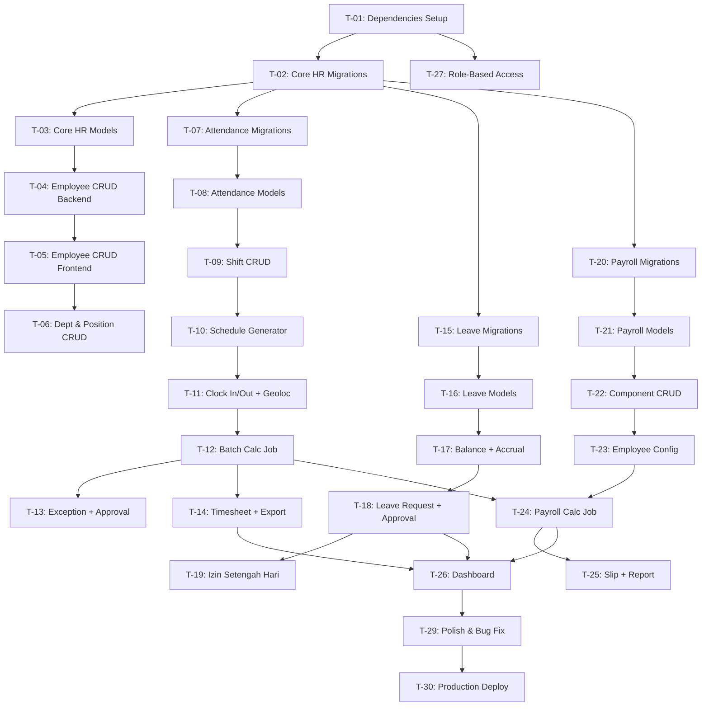

# 🗺️ PLAN: HRIS Internal Admin System — OrcaHR

> **PRD:** [prd-hris-orcahr.md](file:///z:/project/orcahr/docs/prd-hris-orcahr.md)
> **Project Type:** WEB (Laravel 12 + Inertia Vue 3)
> **Status:** PLANNING

---

## Overview

Implementasi sistem HRIS internal (OrcaHR) dari PRD v1.1. Project saat ini adalah **fresh Laravel 12 starter kit** dengan auth (Fortify) + shadcn-vue. Semua modul HRIS perlu dibangun dari nol.

**Existing:**
- Auth (Fortify + shadcn-vue starter kit)
- `users` table + User model
- Dashboard + Welcome + Settings pages
- 160 shadcn-vue components already available

**To Build:**
- Core HR (departments, positions, job_levels, employees)
- Attendance (shifts, schedules, clock-in/out + geoloc/selfie, batch calc)
- Leave Management (types, balances, requests, izin ½ hari, accrual)
- Payroll (components, configs, runs, details, slip gaji)
- Dashboard Analytics + Excel Export

---

## Success Criteria

| Metric | Target |
|--------|--------|
| Semua migration jalan tanpa error | `php artisan migrate` = 0 error |
| CRUD employee lengkap | Create, Read, Update, Delete + search/filter |
| Clock-in/out dengan geoloc + selfie | Capture GPS + foto, validasi radius |
| Leave request + approval workflow | Submit → approve/reject → saldo update |
| Payroll calculation | Hitung gaji berdasarkan komponen + attendance |
| Timesheet export Excel | Download .xlsx dengan filter bulan/dept |

---

## Tech Stack

| Layer | Technology | Sudah Ada? |
|-------|-----------|------------|
| Backend | Laravel 12 | ✅ |
| Frontend | Inertia.js + Vue 3 + shadcn-vue | ✅ |
| Database | MySQL 8.0+ | ✅ (configured) |
| Auth | Fortify + Spatie Permission | ⚠️ Fortify ada, Spatie belum |
| Table | TanStack Vue Table | ❌ Install |
| Queue | Laravel Queue (database/Redis) | ❌ Configure |
| Export | Laravel Excel (Maatwebsite) | ❌ Install |

---

## File Structure (Target)

```
app/
├── Http/Controllers/
│   ├── CoreHR/
│   │   ├── EmployeeController.php
│   │   ├── DepartmentController.php
│   │   └── PositionController.php
│   ├── Attendance/
│   │   ├── ShiftController.php
│   │   ├── ScheduleController.php
│   │   ├── AttendanceController.php
│   │   ├── TimesheetController.php
│   │   └── ExceptionController.php
│   ├── Leave/
│   │   ├── LeaveTypeController.php
│   │   ├── LeaveBalanceController.php
│   │   └── LeaveRequestController.php
│   └── Payroll/
│       ├── PayrollComponentController.php
│       └── PayrollController.php
├── Models/
│   ├── Employee.php
│   ├── Department.php
│   ├── Position.php
│   ├── JobLevel.php
│   ├── ShiftMaster.php
│   ├── EmployeeSchedule.php
│   ├── RawTimeEvent.php
│   ├── AttendanceSummary.php
│   ├── AttendanceException.php
│   ├── LeaveType.php
│   ├── LeaveBalance.php
│   ├── LeaveRequest.php
│   ├── PayrollComponent.php
│   ├── EmployeePayrollConfig.php
│   ├── PayrollRun.php
│   └── PayrollDetail.php
├── Jobs/
│   ├── ProcessAttendanceBatch.php
│   ├── RecalculateDirtySummaries.php
│   └── MonthlyLeaveAccrual.php
└── Exports/
    ├── TimesheetExport.php
    └── PayrollExport.php

resources/js/pages/
├── CoreHR/
│   ├── Employees/ (Index, Create, Edit, Show)
│   ├── Departments/ (Index)
│   └── Positions/ (Index)
├── Attendance/
│   ├── ClockInOut.vue
│   ├── Shifts/ (Index)
│   ├── Schedules/ (Index, Generate)
│   ├── Timesheet/ (Index)
│   └── Exceptions/ (Index)
├── Leave/
│   ├── Balance.vue
│   ├── Request/ (Index, Create)
│   ├── HalfDayPermit/ (Create)
│   └── Approval/ (Index)
├── Payroll/
│   ├── Components/ (Index)
│   ├── Calculate/ (Index)
│   ├── Slip/ (Show)
│   └── Report/ (Index)
└── Dashboard/ (Index)

resources/js/components/
├── DataTable.vue
├── StatusBadge.vue
├── ApprovalActions.vue
├── DateRangePicker.vue
├── SelfieCapture.vue
└── GeolocationMap.vue
```

---

## Task Breakdown

### SPRINT 1: Foundation + Core HR

#### T-01: Install Dependencies & Setup

- **Agent:** `backend-specialist`
- **Skills:** `clean-code`, `nodejs-best-practices`
- **Priority:** P0 (blocker)
- **Dependencies:** None

| | Detail |
|---|--------|
| **INPUT** | Fresh Laravel project |
| **OUTPUT** | Spatie Permission, TanStack Vue Table, Laravel Excel installed & configured |
| **VERIFY** | `composer show spatie/laravel-permission`, `npm list @tanstack/vue-table`, `php artisan vendor:publish --tag=permission-config` |

**Tasks:**
- [ ] `composer require spatie/laravel-permission`
- [ ] `php artisan vendor:publish --provider="Spatie\Permission\PermissionServiceProvider"`
- [ ] `npm install @tanstack/vue-table`
- [ ] `composer require maatwebsite/excel`
- [ ] Configure queue driver di `.env`
- [ ] Setup seeder untuk roles: `super-admin`, `hr`, `manager`, `employee`

---

#### T-02: Core HR Migrations

- **Agent:** `backend-specialist`
- **Skills:** `database-design`, `clean-code`
- **Priority:** P0 (blocker)
- **Dependencies:** T-01

| | Detail |
|---|--------|
| **INPUT** | PRD Section 10 — Migration SQL |
| **OUTPUT** | 4 migration files: `departments`, `job_levels`, `positions`, `employees` |
| **VERIFY** | `php artisan migrate` = success, `php artisan migrate:rollback` = clean |

**Tasks:**
- [ ] Create migration `create_departments_table`
- [ ] Create migration `create_job_levels_table`
- [ ] Create migration `create_positions_table`
- [ ] Create migration `create_employees_table` (with `user_id` FK to `users`)
- [ ] Add encrypted columns to employees: `nik` (TEXT), `nik_hash` (SHA-256 blind index), `npwp`, `phone`, `bank_account_number`, `bank_account_name` (all TEXT for encrypted data)
- [ ] Add `manager_id` FK constraint on departments (deferred)

---

#### T-03: Core HR Models & Relationships

- **Agent:** `backend-specialist`
- **Skills:** `clean-code`
- **Priority:** P0
- **Dependencies:** T-02

| | Detail |
|---|--------|
| **INPUT** | ERD dari PRD Section 4 |
| **OUTPUT** | Eloquent models: `Employee`, `Department`, `Position`, `JobLevel` dengan relationships |
| **VERIFY** | `php artisan tinker` → `Employee::with('department','position','jobLevel')->first()` |

**Tasks:**
- [ ] Create `Employee` model (belongsTo: department, position, jobLevel, user)
- [ ] Add `encrypted` casts: nik, npwp, email, phone, bank_account_number, bank_account_name
- [ ] Add blind index: auto-generate `nik_hash` (SHA-256) on saving
- [ ] Create `Department` model (hasMany: employees, belongsTo: parent, manager)
- [ ] Create `Position` model (belongsTo: department, hasMany: employees)
- [ ] Create `JobLevel` model (hasMany: employees)
- [ ] Seeders untuk department + position + job_level sample data

---

#### T-04: Employee CRUD (Backend)

- **Agent:** `backend-specialist`
- **Skills:** `api-patterns`, `clean-code`
- **Priority:** P0
- **Dependencies:** T-03

| | Detail |
|---|--------|
| **INPUT** | PRD API endpoints section 8.1 |
| **OUTPUT** | `EmployeeController` with index/store/show/update, `EmployeeRequest` validation |
| **VERIFY** | Routes registered: `php artisan route:list --name=employee` |

**Tasks:**
- [ ] Create `EmployeeController` (index, create, store, show, edit, update)
- [ ] Create `StoreEmployeeRequest` + `UpdateEmployeeRequest`
- [ ] Register Inertia routes di `web.php`
- [ ] Implement search/filter/paginate di index

---

#### T-05: Employee CRUD (Frontend)

- **Agent:** `frontend-specialist`
- **Skills:** `frontend-design`, `react-best-practices`, `clean-code`
- **Priority:** P0
- **Dependencies:** T-04

| | Detail |
|---|--------|
| **INPUT** | Vue component structure dari PRD Section 9 |
| **OUTPUT** | 4 Vue pages: `Index.vue`, `Create.vue`, `Edit.vue`, `Show.vue` |
| **VERIFY** | Browser: navigate ke `/employees`, create employee, edit, lihat detail |

**Tasks:**
- [ ] Create `DataTable.vue` component wrapper (TanStack Vue)
- [ ] Create `Employees/Index.vue` (DataTable + search + filter)
- [ ] Create `Employees/Create.vue` (form + validation)
- [ ] Create `Employees/Edit.vue` (pre-filled form)
- [ ] Create `Employees/Show.vue` (profile detail)
- [ ] Sidebar navigation update

---

#### T-06: Department & Position CRUD

- **Agent:** `backend-specialist` + `frontend-specialist`
- **Skills:** `clean-code`
- **Priority:** P1
- **Dependencies:** T-05

| | Detail |
|---|--------|
| **INPUT** | PRD endpoints 8.1 |
| **OUTPUT** | Controller + Vue pages untuk Departments & Positions |
| **VERIFY** | Browser: CRUD departments & positions, dropdown di employee form |

**Tasks:**
- [ ] `DepartmentController` + `PositionController`
- [ ] Vue pages: `Departments/Index.vue`, `Positions/Index.vue`
- [ ] Modal/inline CRUD (shadcn Dialog)
- [ ] Connect employee form dropdowns ke departments/positions/job_levels

---

### SPRINT 2: Attendance

#### T-07: Attendance Migrations

- **Agent:** `backend-specialist`
- **Skills:** `database-design`
- **Priority:** P0 (blocker)
- **Dependencies:** T-02

| | Detail |
|---|--------|
| **INPUT** | PRD Section 10 — Attendance Tables SQL |
| **OUTPUT** | 5 migration files: `shift_masters`, `employee_schedules`, `raw_time_events`, `attendance_summaries`, `attendance_exceptions` |
| **VERIFY** | `php artisan migrate` = success |

**Tasks:**
- [ ] Migration `create_shift_masters_table`
- [ ] Migration `create_employee_schedules_table` (composite index)
- [ ] Migration `create_raw_time_events_table` (selfie_path, lat, lng, JSON metadata)
- [ ] Migration `create_attendance_summaries_table` (UNIQUE employee_id + work_date)
- [ ] Migration `create_attendance_exceptions_table` (half_day_permit, duration_hours)
- [ ] Seeder: default shifts (Pagi, Siang, Malam, Flexible)

---

#### T-08: Attendance Models

- **Agent:** `backend-specialist`
- **Priority:** P0
- **Dependencies:** T-07

| | Detail |
|---|--------|
| **INPUT** | ERD relationships |
| **OUTPUT** | 5 Eloquent models dengan relationships |
| **VERIFY** | Tinker: `ShiftMaster::with('schedules')->first()` |

**Tasks:**
- [ ] `ShiftMaster`, `EmployeeSchedule`, `RawTimeEvent`, `AttendanceSummary`, `AttendanceException` models
- [ ] All relationships defined

---

#### T-09: Shift CRUD

- **Agent:** `backend-specialist` + `frontend-specialist`
- **Priority:** P1
- **Dependencies:** T-08

| | Detail |
|---|--------|
| **INPUT** | PRD endpoints 8.2 |
| **OUTPUT** | `ShiftController` + `Shifts/Index.vue` |
| **VERIFY** | Browser: create/edit/delete shift templates |

---

#### T-10: Schedule Generator

- **Agent:** `backend-specialist` + `frontend-specialist`
- **Priority:** P0
- **Dependencies:** T-09

| | Detail |
|---|--------|
| **INPUT** | PRD User Story US-01 |
| **OUTPUT** | `ScheduleController@generate` + `Schedules/Generate.vue` + `Schedules/Index.vue` |
| **VERIFY** | HR generate schedule range (1-10 Pagi, 11-20 Malam) → database records created |

**Tasks:**
- [ ] `ScheduleController` (index, generate)
- [ ] Bulk generate logic: date range + shift assignment
- [ ] Generate.vue form: select employees, shifts, date range
- [ ] Index.vue: calendar/table view of schedules

---

#### T-11: Clock In/Out + Geoloc + Selfie

- **Agent:** `frontend-specialist` + `backend-specialist`
- **Priority:** P0
- **Dependencies:** T-10

| | Detail |
|---|--------|
| **INPUT** | PRD User Story US-02, flowchart 5.1 |
| **OUTPUT** | `AttendanceController@clock`, `ClockInOut.vue`, `SelfieCapture.vue`, `GeolocationMap.vue`, `useGeolocation.ts` |
| **VERIFY** | Employee clock in: GPS captured, selfie stored, raw_time_event created |

**Tasks:**
- [ ] `SelfieCapture.vue` — camera capture via `navigator.mediaDevices`
- [ ] `useGeolocation.ts` — GPS permission, radius validation (≤500m)
- [ ] `GeolocationMap.vue` — preview lokasi pada map
- [ ] `AttendanceController@clock` — validate GPS radius, store selfie file, insert raw_time_event
- [ ] `ClockInOut.vue` — clock button + status + today summary
- [ ] File upload handling (selfie → `storage/app/selfies/` via encrypted disk)

---

#### T-12: Batch Calculation Job

- **Agent:** `backend-specialist`
- **Skills:** `clean-code`
- **Priority:** P0
- **Dependencies:** T-11

| | Detail |
|---|--------|
| **INPUT** | PRD pseudo-code 5.2 |
| **OUTPUT** | `ProcessAttendanceBatch` job, `RecalculateDirtySummaries` job, cron schedule |
| **VERIFY** | Clock in/out → wait 5 min → attendance_summary record created with correct late/OT |

**Tasks:**
- [ ] `ProcessAttendanceBatch` job (match schedule, calc late/OT/duration)
- [ ] `RecalculateDirtySummaries` job (find dirty_flag=true, re-dispatch)
- [ ] Register cron di `routes/console.php`: every 5 min + every 10 min
- [ ] Handle overnight shift edge case (`is_overnight` flag)

---

#### T-13: Exception Handling + Approval

- **Agent:** `backend-specialist` + `frontend-specialist`
- **Priority:** P0
- **Dependencies:** T-12

| | Detail |
|---|--------|
| **INPUT** | PRD User Story US-03 |
| **OUTPUT** | `ExceptionController`, `Exceptions/Index.vue`, `ApprovalActions.vue` |
| **VERIFY** | Manager approve OT → dirty_flag set → recalc triggered |

**Tasks:**
- [ ] `ExceptionController` (store, approve, reject)
- [ ] `Exceptions/Index.vue` (list pending exceptions)
- [ ] `ApprovalActions.vue` (approve/reject buttons, reusable)
- [ ] On approve → set `attendance_summary.dirty_flag = true`

---

#### T-14: Timesheet View + Export

- **Agent:** `frontend-specialist` + `backend-specialist`
- **Priority:** P1
- **Dependencies:** T-12

| | Detail |
|---|--------|
| **INPUT** | PRD User Story US-04 |
| **OUTPUT** | `TimesheetController`, `Timesheet/Index.vue`, `TimesheetExport.php` |
| **VERIFY** | HR filters bulan+dept → sees data table → clicks export → .xlsx downloads |

**Tasks:**
- [ ] `TimesheetController` (index, export)
- [ ] `Timesheet/Index.vue` (DataTable + month filter + dept filter)
- [ ] `TimesheetExport.php` (Maatwebsite Excel)
- [ ] `DateRangePicker.vue` component

---

### SPRINT 3: Leave Management

#### T-15: Leave Migrations

- **Agent:** `backend-specialist`
- **Priority:** P0 (blocker)
- **Dependencies:** T-02

| | Detail |
|---|--------|
| **INPUT** | PRD Section 10 — Leave Tables SQL |
| **OUTPUT** | 3 migration files: `leave_types`, `leave_balances`, `leave_requests` |
| **VERIFY** | `php artisan migrate` = success |

---

#### T-16: Leave Models + Seeders

- **Agent:** `backend-specialist`
- **Priority:** P0
- **Dependencies:** T-15

| | Detail |
|---|--------|
| **INPUT** | ERD relationships |
| **OUTPUT** | Models + seeder (Cuti Tahunan, Sakit, Melahirkan, Menikah, ITD) |
| **VERIFY** | `LeaveType::all()` returns 5 records |

---

#### T-17: Leave Balance + Monthly Accrual Job

- **Agent:** `backend-specialist`
- **Priority:** P0
- **Dependencies:** T-16

| | Detail |
|---|--------|
| **INPUT** | PRD pseudo-code 6.2, leave lifecycle 6.3 |
| **OUTPUT** | `MonthlyLeaveAccrual` job, carryover logic, `LeaveBalanceController` |
| **VERIFY** | Run accrual job → leave_balance snapshot created, capped at max_balance |

**Tasks:**
- [ ] `MonthlyLeaveAccrual` job (accrual per employee per leave type)
- [ ] Carryover logic (yearly job, max_carryover cap, expiry_date)
- [ ] `LeaveBalanceController@index` (show saldo per employee)
- [ ] Cron: monthly accrual (1st of month), yearly carryover (1 Jan)

---

#### T-18: Leave Request + Approval Workflow

- **Agent:** `backend-specialist` + `frontend-specialist`
- **Priority:** P0
- **Dependencies:** T-17

| | Detail |
|---|--------|
| **INPUT** | PRD User Stories US-05, US-07 |
| **OUTPUT** | `LeaveRequestController`, Request/Index, Create, Approval/Index pages |
| **VERIFY** | Employee submit cuti → Manager approve → saldo deducted → attendance exception created |

**Tasks:**
- [ ] `LeaveRequestController` (store, index, approve, reject, cancel)
- [ ] Balance validation before submit
- [ ] On approve: deduct `leave_balance.used`, insert `attendance_exception`, set dirty_flag
- [ ] On reject: require `reject_reason`
- [ ] On cancel: refund `leave_balance.used`
- [ ] `Leave/Request/Create.vue`, `Leave/Request/Index.vue`, `Leave/Approval/Index.vue`
- [ ] `Leave/Balance.vue` (saldo cards)

---

#### T-19: Izin Setengah Hari

- **Agent:** `backend-specialist` + `frontend-specialist`
- **Priority:** P0
- **Dependencies:** T-18

| | Detail |
|---|--------|
| **INPUT** | PRD User Story US-06 |
| **OUTPUT** | Half-day permit form, validation (min ½ shift), attendance integration |
| **VERIFY** | Submit izin ½ hari (4 jam dari shift 8 jam) → approved → status `half_permit` |

**Tasks:**
- [ ] Validation: `duration_hours >= shift.total_hours / 2`
- [ ] `HalfDayPermit/Create.vue` form
- [ ] Controller action for half_day_permit exception
- [ ] Attendance recalculation: partial work_duration

---

### SPRINT 4: Payroll

#### T-20: Payroll Migrations

- **Agent:** `backend-specialist`
- **Priority:** P0 (blocker)
- **Dependencies:** T-02

| | Detail |
|---|--------|
| **INPUT** | PRD Section 10 — Payroll Tables SQL |
| **OUTPUT** | 4 migration files + seeders (komponen gaji default) |
| **VERIFY** | `php artisan migrate`, PayrollComponent::all() returns 8 records |

---

#### T-21: Payroll Models

- **Agent:** `backend-specialist`
- **Priority:** P0
- **Dependencies:** T-20

| | Detail |
|---|--------|
| **INPUT** | ERD + komponen gaji structure |
| **OUTPUT** | `PayrollComponent`, `EmployeePayrollConfig`, `PayrollRun`, `PayrollDetail` models |
| **VERIFY** | Relationships correct via tinker |

**Tasks:**
- [ ] Create all 4 models with relationships
- [ ] Add `encrypted` cast on `EmployeePayrollConfig.amount` (salary data PDP-compliant)

---

#### T-22: Payroll Component CRUD

- **Agent:** `backend-specialist` + `frontend-specialist`
- **Priority:** P0
- **Dependencies:** T-21

| | Detail |
|---|--------|
| **INPUT** | PRD API endpoints 8.4 |
| **OUTPUT** | `PayrollComponentController`, `Components/Index.vue` |
| **VERIFY** | HR manages earning/deduction components via UI |

---

#### T-23: Employee Payroll Config

- **Agent:** `backend-specialist` + `frontend-specialist`
- **Priority:** P0
- **Dependencies:** T-22

| | Detail |
|---|--------|
| **INPUT** | PRD payroll_configs structure |
| **OUTPUT** | Per-employee salary configuration UI (inside employee profile) |
| **VERIFY** | Set Gaji Pokok = 5.000.000 for employee → config saved |

---

#### T-24: Payroll Calculation Job

- **Agent:** `backend-specialist`
- **Priority:** P0
- **Dependencies:** T-23, T-12 (attendance data needed)

| | Detail |
|---|--------|
| **INPUT** | Attendance summaries + payroll configs + components |
| **OUTPUT** | `PayrollController@calculate`, calculation logic |
| **VERIFY** | Calculate payroll bulan Maret → payroll_run + payroll_details created correctly |

**Tasks:**
- [ ] Calculate gross: sum all `earning` components per employee
- [ ] Calculate deductions: BPJS, PPh21

- [ ] OT calculation: `overtime_minutes × hourly_rate × 1.5`
- [ ] Attendance deductions: late penalty, absence penalty
- [ ] Net pay = gross - deductions
- [ ] Payroll run workflow: draft → calculated → approved → paid

---

#### T-25: Slip Gaji + Payroll Report

- **Agent:** `frontend-specialist` + `backend-specialist`
- **Priority:** P1
- **Dependencies:** T-24

| | Detail |
|---|--------|
| **INPUT** | payroll_runs + payroll_details |
| **OUTPUT** | `Slip/Show.vue`, `Report/Index.vue`, `PayrollExport.php` |
| **VERIFY** | Employee views own slip, HR exports payroll report as Excel |

---

### SPRINT 5: Dashboard + Polish

#### T-26: Dashboard Analytics

- **Agent:** `frontend-specialist`
- **Priority:** P1
- **Dependencies:** T-14, T-18, T-24

| | Detail |
|---|--------|
| **INPUT** | Attendance summaries, leave balances, payroll data |
| **OUTPUT** | `Dashboard/Index.vue` with analytics cards + charts |
| **VERIFY** | Dashboard shows: total employees, attendance today, pending leaves, payroll summary |

---

#### T-27: Role-Based Navigation & Middleware

- **Agent:** `backend-specialist`
- **Priority:** P0
- **Dependencies:** T-01

| | Detail |
|---|--------|
| **INPUT** | Spatie Permission roles |
| **OUTPUT** | Middleware enforcement, sidebar menu per role |
| **VERIFY** | Employee login → sees only ClockInOut + Balance + Request. HR → sees all. |

---

#### T-28: StatusBadge Component

- **Agent:** `frontend-specialist`
- **Priority:** P2
- **Dependencies:** None

| | Detail |
|---|--------|
| **INPUT** | Status values across modules |
| **OUTPUT** | Reusable `StatusBadge.vue` (color-coded per status) |
| **VERIFY** | `present`=green, `absent`=red, `pending`=yellow, etc. |

---

#### T-29: Polish & Bug Fix

- **Agent:** all
- **Priority:** P1
- **Dependencies:** T-01 through T-28

| | Detail |
|---|--------|
| **INPUT** | UAT feedback |
| **OUTPUT** | Bug fixes, UI polish, edge case handling |
| **VERIFY** | All test cases from PRD Section 11 pass |

---

#### T-30: Production Deploy

- **Agent:** `backend-specialist`
- **Priority:** P0
- **Dependencies:** T-29

| | Detail |
|---|--------|
| **INPUT** | Verified build |
| **OUTPUT** | Deployed application |
| **VERIFY** | `php artisan migrate --force` on prod, health check passes |

---

## Dependency Graph



---

## Sprint Timeline

| Sprint | Durasi | Tasks | Focus |
|--------|--------|-------|-------|
| **Sprint 1** | 3 minggu | T-01 ~ T-06 | Foundation + Core HR |
| **Sprint 2** | 3 minggu | T-07 ~ T-14 | Attendance (8 tasks) |
| **Sprint 3** | 2.5 minggu | T-15 ~ T-19 | Leave Management |
| **Sprint 4** | 2.5 minggu | T-20 ~ T-25 | Payroll |
| **Sprint 5** | 2 minggu | T-26 ~ T-30 | Dashboard + Deploy |

---

## Phase X: Verification Checklist

- [ ] `php artisan migrate:fresh --seed` = 0 error
- [ ] Semua routes registered: `php artisan route:list`
- [ ] Employee CRUD (create, read, update via browser)
- [ ] Clock In/Out captures GPS + selfie
- [ ] Batch calc job processes raw events → summary
- [ ] Leave request → approve → saldo deducted
- [ ] Izin ½ hari → min half-shift validated
- [ ] Payroll calc → slip gaji correct
- [ ] Timesheet export → valid .xlsx file
- [ ] Role-based access enforced
- [ ] PRD edge cases (Section 11) validated:
  - [ ] TC-01: Shift change mid-period
  - [ ] TC-02: Retro approval + dirty flag recalc
  - [ ] TC-03: Leave balance edge cases (carryover, prorata)
  - [ ] TC-04: Race conditions (double clock, concurrent approve)
- [ ] `npm run build` = 0 error
- [ ] Security: no mass-assignable sensitive fields
- [ ] Performance: timesheet query with 1000+ records < 2s

---

> **[OK]** Plan created: `docs/PLAN-hris-system.md`
>
> **Next steps:**
> - Review plan ini
> - Jalankan `/create` untuk mulai implementasi Sprint 1
> - Atau modifikasi plan secara manual
