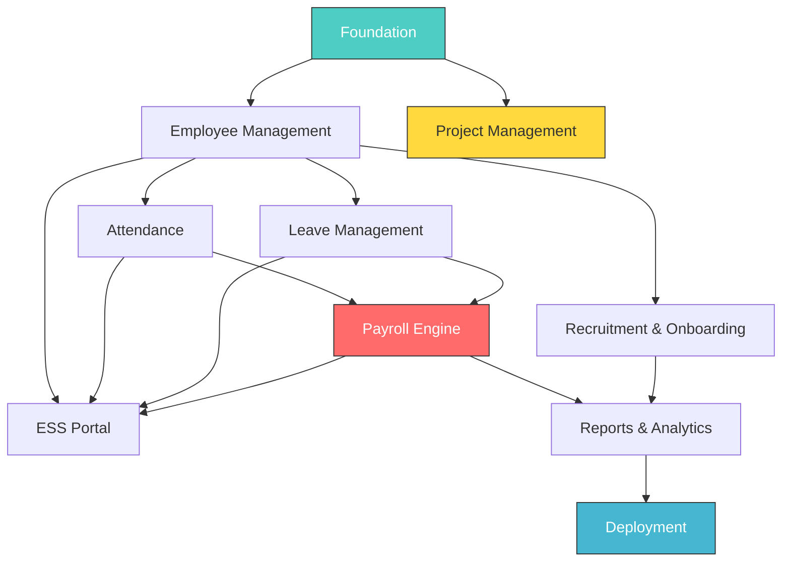

# 🏗️ Project Blueprint — OrcaHR

> Breakdown modul, prioritas, dan timeline untuk **solo developer**.
> Tech Stack: **Laravel 12 + Blade + Alpine.js + Tailwind CSS**
> Arsitektur: **Service Layer Pattern** (siap migrasi ke API + Vue nanti)
> ID Strategy: **ULID** • Auth: **Breeze** (logic only, custom views)

---

## Fase Overview

```
Fase 1 (Minggu 1-4)    → Foundation + Employee Management
Fase 2 (Minggu 5-8)    → Attendance + Leave
Fase 3 (Minggu 9-14)   → Payroll Engine (CORE)
Fase 4 (Minggu 15-18)  → Employee Self-Service (ESS)
Fase 5 (Minggu 19-24)  → Recruitment & Onboarding
Fase 6 (Minggu 25-28)  → Project Management
Fase 7 (Minggu 29-32)  → Polish + Deployment
```

> [!IMPORTANT]
> **Payroll adalah inti project ini.** Fase 1-2 adalah fondasi agar Fase 3 bisa berjalan.

---

## Fase 1: Foundation + Employee Management (Minggu 1-4)

> **Goal:** Sistem dasar berjalan, data karyawan bisa dikelola.

### Minggu 1-2: Foundation
| Task | Detail |
|---|---|
| Laravel setup | Laravel 12, Breeze auth (logic only), Spatie permission |
| Tailwind setup | Tailwind CSS, base layout |
| Auth flow | Login, session-based auth (Breeze controllers, custom views) |
| RBAC | Middleware role-based + Blade directives |
| Base UI | Admin layout, sidebar, navigation (Blade components) |
| Audit log | Setup dari awal (Architecture Principle #5) |
| Security foundation | HTTPS, encryption helpers, HMAC helpers |
| Service Layer | Base service class pattern |

### Minggu 3-4: Employee Management
| Task | Detail |
|---|---|
| Employee CRUD | Controller → Service → Model pattern |
| Employee views | Blade pages: list, create, edit (multi-step) |
| Organisasi | Department, position, job level |
| Dokumen | Upload, encrypted storage, signed URL |
| DataTable | Reusable Blade component + Alpine interactivity |

**✅ Milestone:** Admin bisa input, edit, dan cari data karyawan.

---

## Fase 2: Attendance + Leave (Minggu 5-8)

> **Goal:** Absensi tercatat harian, cuti bisa diajukan dan diapprove.

### Minggu 5-6: Attendance
| Task | Detail |
|---|---|
| Shift management | CRUD shift + schedule assignment (effective-dated) |
| Clock in/out | Blade page + Alpine UX |
| Daily attendance engine | Recalculation service (event-driven) |
| Attendance correction | Request + approval flow |
| Overtime request | Request + approval flow |
| Monthly recap | Per karyawan + per department |

### Minggu 7-8: Leave Management
| Task | Detail |
|---|---|
| Leave types + policy | CRUD + quota configuration |
| Leave balance | Per karyawan per tahun, carry-forward |
| Leave request | Submit + approval workflow |
| Holiday calendar | CRUD hari libur nasional/perusahaan |
| Kalender | Alpine.js calendar — visual cuti tim |

**✅ Milestone:** Absensi harian berjalan, cuti bisa diajukan dan di-approve.

---

## Fase 3: Payroll Engine (Minggu 9-14) ⭐

> **Goal:** Payroll fleksibel yang bisa handle multi-skema.

### Minggu 9-10: Payroll Foundation
| Task | Detail |
|---|---|
| Payroll components | CRUD komponen gaji (earning/deduction) |
| Payroll schemas | CRUD skema, assign komponen ke skema |
| Formula engine | Rumus kalkulasi fleksibel per komponen |
| Employee assignment | Assign karyawan ke skema (effective-dated) |
| Component override | Override nilai per karyawan |

### Minggu 11-12: Payroll Processing
| Task | Detail |
|---|---|
| Payroll run | Generate kalkulasi per karyawan per skema |
| Attendance integration | Variable components dari daily attendance |
| Review UI | Blade page untuk review + adjust sebelum finalize |
| Period lock | Lock/unlock mechanism + adjustment |

### Minggu 13-14: Payroll Output
| Task | Detail |
|---|---|
| Slip gaji | Generate PDF per karyawan |
| Rekap payroll | Summary per department, per skema |
| PPh 21 | Kalkulasi pajak penghasilan dasar |
| Bank export | Export data untuk transfer bank |
| Payroll adjustment | Backpay/correction untuk period yang sudah lock |

**✅ Milestone:** Slip gaji bisa di-generate untuk minimal 2 skema payroll berbeda.

---

## Fase 4: Employee Self-Service / ESS (Minggu 15-18)

> **Goal:** Karyawan bisa akses data sendiri dan melakukan self-service.

| Task | Detail |
|---|---|
| ESS Dashboard | Personal dashboard: profil, attendance, cuti |
| Profil management | Edit data pribadi (dengan approval flow) |
| Attendance view | Lihat riwayat attendance + clock in/out sendiri |
| Leave self-service | Ajukan cuti, lihat saldo, histori |
| Slip gaji | Download slip gaji sendiri |
| Request hub | Satu tempat untuk semua request (cuti, OT, koreksi) |
| Notification center | Notifikasi approval, pengumuman, reminder |
| Announcement | Company-wide announcements + targeted |

**✅ Milestone:** Seluruh karyawan bisa login dan akses data mereka sendiri.

---

## Fase 5: Recruitment & Onboarding (Minggu 19-24)

> **Goal:** Proses rekrutmen dari request sampai karyawan onboard.

### Minggu 19-21: Recruitment
| Task | Detail |
|---|---|
| Manpower request | Department ajukan kebutuhan karyawan baru |
| Job posting | Buat dan publish lowongan |
| Applicant tracking | Database pelamar, status tracking |
| Interview scheduling | Jadwal interview, feedback form |
| Offering | Generate surat penawaran |

### Minggu 22-24: Onboarding
| Task | Detail |
|---|---|
| Onboarding checklist | Template checklist per posisi |
| Document collection | Karyawan baru upload dokumen |
| Account setup | Auto-create user account, assign role |
| Training plan | Checklist training untuk karyawan baru |
| Probation tracking | Monitor masa percobaan, reminder H-30 |

**✅ Milestone:** Proses rekrutmen dari manpower request → job posting → onboard terotomasi.

---

## Fase 6: Project Management (Minggu 25-28)

> **Goal:** Kolaborasi tim via kanban board dan task management.

### Minggu 25-26: Core
| Task | Detail |
|---|---|
| Projects | CRUD project, assign members, visibility |
| Task/Issue | Create, assign, priority, due date, labels |
| Kanban board | Alpine.js drag-and-drop board |
| List view | Table view dengan filter dan sort |
| Comments | Discussion thread per task |
| Attachments | File upload per task |

### Minggu 27-28: Collaboration
| Task | Detail |
|---|---|
| Sprint/Milestone | Group tasks into sprint atau milestone |
| Activity log | Histori perubahan per task |
| Notifications | Mention, assignment, due date reminder |
| Dashboard | Project overview, progress chart |

**✅ Milestone:** Tim bisa manage tasks via kanban/list view, track progress per project.

---

## Fase 7: Polish + Deployment (Minggu 29-32)

> **Goal:** Sistem siap dipakai production.

| Task | Detail |
|---|---|
| Report & analytics | Dashboard ringkasan HR, attendance, payroll |
| Cross-module reports | Report yang gabungkan data dari multiple modules |
| Bug fixing | Fix issues dari testing |
| Performance tuning | Query optimization, caching |
| User testing | UAT bersama Admin HR + karyawan |
| Deployment | Setup server, deploy production |
| Dokumentasi | User guide |

**✅ Milestone:** Sistem live dan dipakai seluruh organisasi.

---

## Tech Stack

| Layer | Pilihan | Alasan |
|---|---|---|
| **Framework** | Laravel 12 (full-stack) | Latest, PHP 8.2+, all-in-one |
| **Views** | Blade templates | Server-rendered, fast development |
| **Interactivity** | Alpine.js | Lightweight JS reactivity, no build step |
| **Styling** | Tailwind CSS | Utility-first, rapid UI |
| **UI Components** | Blade components | Reusable, composable |
| **ID Strategy** | ULID (`HasUlids` trait) | Secure, sortable, non-guessable |
| **Database** | MySQL 8 | Reliable, familiar |
| **Auth** | Laravel Breeze (logic only) | Auth controllers + routes, custom views |
| **Permission** | Spatie Permission | Role & permission management |
| **Report** | DomPDF / Laravel Excel | Slip gaji & export |
| **Queue** | Laravel Queue (Redis) | Background jobs, recalculation |
| **Server** | VPS / internal server | Data HR sensitif |

### Arsitektur Service Layer

```
Route → Controller (thin) → Service (business logic) → Model
              ↓
         Blade View

── Nanti (migrasi Vue) ──

API Route → API Controller (thin) → Service (SAMA) → Model
                    ↓
              JSON Response → Vue.js SPA
```

> [!TIP]
> **Service class = investasi.** Logic yang ditulis sekarang di Service class bisa langsung dipakai oleh API controller nanti tanpa rewrite.

---

## Dependency Map



---

## Risiko Timeline

| Risiko | Dampak | Rencana |
|---|---|---|
| Payroll engine lebih kompleks dari estimasi | Fase 3 mundur 2-4 minggu | Buffer 6 minggu untuk payroll |
| Recruitment scope membesar | Fase 5 mundur | Scope freeze sebelum mulai fase |
| Project Management terlalu ambisius | Fase 6 mundur | MVP kanban dulu, iterate later |
| Burnout (solo developer) | Kualitas turun | Max 8 jam/hari, weekend off |

---

> [!TIP]
> **Prinsip solo developer:**
> - ✅ Satu fase harus **selesai dan bisa dipakai** sebelum lanjut
> - ✅ Deploy **setiap akhir fase** untuk feedback
> - ✅ Jangan perfectionist — **working > perfect**
> - ❌ Jangan kerjakan 2 fase bersamaan
> - 🔮 **Fase Vue SPA** bisa ditambahkan nanti setelah semua modul stabil

---

## Future: Migrasi ke Vue.js SPA

> Setelah semua modul berjalan stabil dengan Blade, migrasi ke Vue:

| Task | Estimasi |
|---|---|
| Setup Vue 3 + Vite + Pinia + Vue Router | 1 minggu |
| Tambah API controllers (thin, panggil Service) | 2-3 minggu |
| Build Vue pages per modul | 4-6 minggu |
| Testing + deployment | 1 minggu |
| **Total** | **~8-10 minggu** |

> Service classes **tidak perlu diubah** — hanya tambah API controller baru.

---

*Dibuat: 3 Maret 2026 • Terakhir diperbarui: 4 Maret 2026*
*Estimasi total: ~32 minggu (~8 bulan)*
*Mode: Solo Developer • Single Company*
