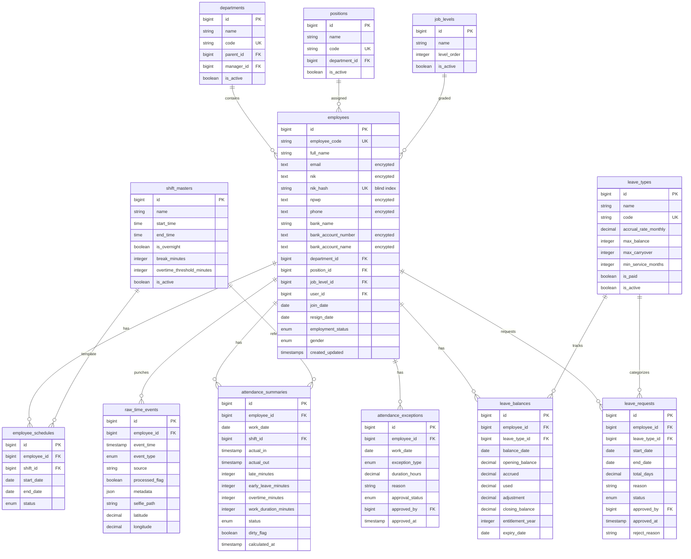
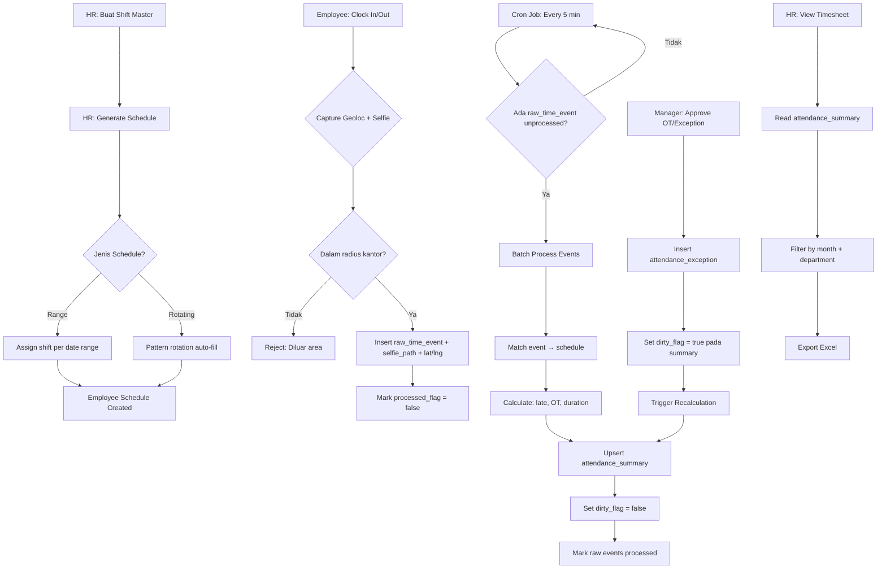
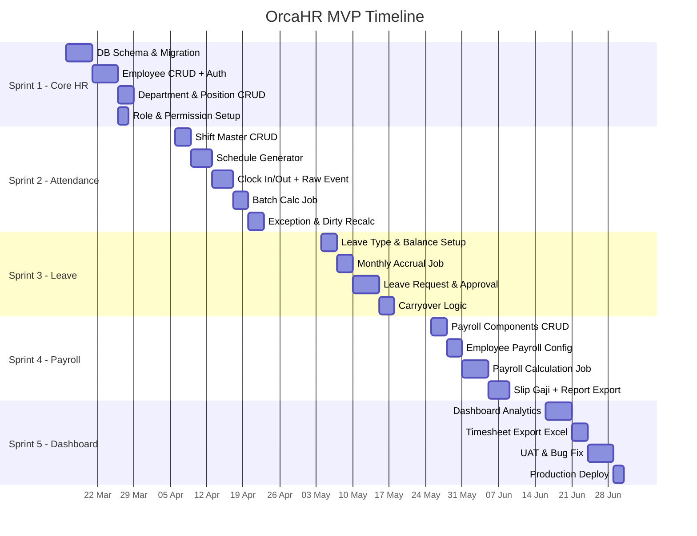

# 📋 Product Requirements Document (PRD)
# HRIS Internal Admin System — OrcaHR

> **Versi:** 1.1 | **Tanggal:** 13 Maret 2026 | **Status:** Draft
> **Tech Stack:** Laravel 12 + Inertia Vue 3 + MySQL

---

## 1. Executive Summary

OrcaHR adalah sistem HRIS internal yang dirancang untuk mengotomatisasi proses kepegawaian, absensi, cuti, dan penggajian. Sistem ini menggunakan arsitektur **event-driven + time-driven** untuk modul attendance dengan **geolocation + selfie verification** saat clock-in, serta **accrual-based entitlement** untuk leave management sesuai regulasi ketenagakerjaan Indonesia (UU Cipta Kerja & PP 35/2021). Sistem mendukung **izin setengah hari** (minimum setengah jadwal shift). Payroll **dihitung langsung di dalam sistem** (bukan export ke pihak ketiga). Target utama adalah mengurangi waktu proses payroll hingga 80%, menurunkan error rate absensi di bawah 1%, dan mencapai adopsi pengguna >90% dalam 3 bulan pertama. MVP dibangun dalam 5 sprint selama 3 bulan dengan prioritas: Core HR → Attendance → Leave → Payroll → Dashboard & Export.

---

## 2. Target Pengguna & Persona

| Persona | Role | Kebutuhan Utama | Akses |
|---------|------|-----------------|-------|
| **HR Admin** | Mengelola data master, jadwal, absensi | Bulk schedule, timesheet export, accrual config | Full CRUD semua modul |
| **Manager** | Approve/reject request bawahan | Quick approval, team overview, exception handling | Read team data + approve |
| **Karyawan** | Self-service absensi & cuti | Clock in/out, cek saldo cuti, ajukan cuti | Read & create own data |
| **Super Admin** | Konfigurasi sistem | Role management, system settings | Full system access |

---

## 3. Prioritas MoSCoW

| Priority | Modul | Sprint |
|----------|-------|--------|
| **MUST** | Core HR (Employee Master, Department, Position) | Sprint 1 |
| **MUST** | Attendance (Schedule, Punch + Geoloc/Selfie, Summary, Exception) | Sprint 2 |
| **MUST** | Leave Management (Type, Balance, Request, Approval, Izin ½ Hari) | Sprint 3 |
| **MUST** | Payroll (Komponen Gaji, Kalkulasi, Slip Gaji) | Sprint 4 |
| **SHOULD** | Dashboard Analytics + Excel Export | Sprint 5 |
| **COULD** | Mobile PWA Clock-in | Post-MVP |
| **WON'T** | Recruitment, Training, Performance Review | Backlog |

---

## 4. Data Model

### 4.1 Entity Relationship Diagram (ERD)



### 4.2 Spesifikasi Tabel Detail

#### Core HR Tables

| Tabel | Kolom | Tipe | Constraint | Keterangan |
|-------|-------|------|------------|------------|
| **employees** | id | BIGINT | PK, AUTO | |
| | employee_code | VARCHAR(20) | UNIQUE, NOT NULL | Format: EMP-YYYYMMDD-XXX |
| | full_name | VARCHAR(100) | NOT NULL | Public info |
| | email | TEXT | NOT NULL | 🔒 Encrypted (AES-256) |
| | nik | TEXT | NULLABLE | 🔒 Encrypted — Identitas (PDP UU27/2022) |
| | nik_hash | VARCHAR(64) | UNIQUE, NULLABLE | Blind index (SHA-256) untuk lookup |
| | npwp | TEXT | NULLABLE | 🔒 Encrypted — Data pajak |
| | phone | TEXT | NULLABLE | 🔒 Encrypted — Kontak pribadi |
| | bank_name | VARCHAR(50) | NULLABLE | Nama bank (tidak sensitif) |
| | bank_account_number | TEXT | NULLABLE | 🔒 Encrypted — Data finansial |
| | bank_account_name | TEXT | NULLABLE | 🔒 Encrypted — Data finansial |
| | department_id | BIGINT | FK → departments | |
| | position_id | BIGINT | FK → positions | |
| | job_level_id | BIGINT | FK → job_levels | |
| | user_id | BIGINT | FK → users, UNIQUE | Login account |
| | join_date | DATE | NOT NULL | Tanggal bergabung |
| | resign_date | DATE | NULLABLE | NULL = masih aktif |
| | employment_status | ENUM | active/probation/resigned/terminated | |
| | gender | ENUM | male/female | |

#### Attendance Tables

| Tabel | Kolom | Tipe | Constraint | Keterangan |
|-------|-------|------|------------|------------|
| **shift_masters** | id | BIGINT | PK | |
| | name | VARCHAR(50) | NOT NULL | "Pagi", "Malam", "Flexible" |
| | start_time | TIME | NOT NULL | 08:00:00 |
| | end_time | TIME | NOT NULL | 17:00:00 |
| | is_overnight | BOOLEAN | DEFAULT false | Untuk shift malam |
| | break_minutes | INT | DEFAULT 60 | Durasi istirahat |
| | overtime_threshold_minutes | INT | DEFAULT 30 | Min. OT dihitung |
| | is_active | BOOLEAN | DEFAULT true | |
| **employee_schedules** | employee_id | BIGINT | FK, NOT NULL | |
| | shift_id | BIGINT | FK, NOT NULL | |
| | start_date | DATE | NOT NULL | Mulai berlaku |
| | end_date | DATE | NULLABLE | NULL = open-ended |
| | status | ENUM | active/inactive | |
| **raw_time_events** | employee_id | BIGINT UNSIGNED | FK, NOT NULL | |
| | event_time | DATETIME | NOT NULL | Waktu punch |
| | event_type | ENUM('IN','OUT') | NOT NULL | |
| | source | VARCHAR(20) | NOT NULL | web/mobile/device |
| | processed_flag | TINYINT(1) | DEFAULT 0 | Sudah diproses? |
| | selfie_path | VARCHAR(255) | NULLABLE | Path foto selfie saat clock |
| | latitude | DECIMAL(10,7) | NULLABLE | Koordinat GPS |
| | longitude | DECIMAL(10,7) | NULLABLE | Koordinat GPS |
| | metadata | JSON | NULLABLE | {device_id, accuracy, address} |
| **attendance_summaries** | employee_id | BIGINT | FK, NOT NULL | |
| | work_date | DATE | NOT NULL | |
| | shift_id | BIGINT | FK | Schedule saat itu |
| | actual_in | TIMESTAMPTZ | NULLABLE | |
| | actual_out | TIMESTAMPTZ | NULLABLE | |
| | late_minutes | INT | DEFAULT 0 | |
| | early_leave_minutes | INT | DEFAULT 0 | |
| | overtime_minutes | INT | DEFAULT 0 | |
| | work_duration_minutes | INT | DEFAULT 0 | |
| | status | ENUM | present/absent/late/leave/holiday/half_permit | |
| | dirty_flag | TINYINT(1) | DEFAULT 1 | Perlu recalc? |
| | calculated_at | DATETIME | NULLABLE | |
| **UNIQUE INDEX** | | | (employee_id, work_date) | Satu record/hari |
| **attendance_exceptions** | employee_id | BIGINT UNSIGNED | FK, NOT NULL | |
| | work_date | DATE | NOT NULL | |
| | exception_type | ENUM | leave/overtime/holiday/sick/permit/half_day_permit | Termasuk izin ½ hari |
| | duration_hours | DECIMAL(4,2) | NULLABLE | Untuk half_day_permit: min ½ shift |
| | reason | TEXT | NULLABLE | |
| | approval_status | ENUM | pending/approved/rejected | |
| | approved_by | BIGINT UNSIGNED | FK → users, NULLABLE | |

#### Leave Tables

| Tabel | Kolom | Tipe | Constraint | Keterangan |
|-------|-------|------|------------|------------|
| **leave_types** | name | VARCHAR(50) | NOT NULL | "Cuti Tahunan" |
| | code | VARCHAR(10) | UNIQUE | CT, CS, CI |
| | accrual_rate_monthly | DECIMAL(4,2) | DEFAULT 1.00 | 1 hari/bulan |
| | max_balance | INT | DEFAULT 12 | Maks saldo |
| | max_carryover | INT | DEFAULT 6 | Maks carry forward |
| | min_service_months | INT | DEFAULT 12 | Min. masa kerja |
| | is_paid | BOOLEAN | DEFAULT true | |
| **leave_balances** | employee_id | BIGINT | FK | |
| | leave_type_id | BIGINT | FK | |
| | balance_date | DATE | NOT NULL | Snapshot date |
| | opening_balance | DECIMAL(5,2) | DEFAULT 0 | Saldo awal periode |
| | accrued | DECIMAL(5,2) | DEFAULT 0 | Akumulasi bulan ini |
| | used | DECIMAL(5,2) | DEFAULT 0 | Terpakai |
| | adjustment | DECIMAL(5,2) | DEFAULT 0 | Manual adj |
| | closing_balance | DECIMAL(5,2) | DEFAULT 0 | = opening + accrued - used + adj |
| | entitlement_year | INT | NOT NULL | Tahun hak cuti |
| | expiry_date | DATE | NOT NULL | Batas pakai |
| **leave_requests** | employee_id | BIGINT | FK | |
| | leave_type_id | BIGINT | FK | |
| | start_date | DATE | NOT NULL | |
| | end_date | DATE | NOT NULL | |
| | total_days | DECIMAL(4,1) | NOT NULL | Dalam satuan hari penuh |
| | reason | TEXT | NULLABLE | |
| | status | ENUM | pending/approved/rejected/cancelled | |
| | approved_by | BIGINT | FK → users, NULLABLE | |

---

## 5. Modul Attendance — Detail

### 5.1 Flowchart Proses Attendance



### 5.2 Pseudo-code: Batch Calculation

```php
// App\Jobs\ProcessAttendanceBatch.php

class ProcessAttendanceBatch implements ShouldQueue
{
    public function handle(): void
    {
        // 1. Ambil semua raw events yang belum diproses
        $unprocessed = RawTimeEvent::where('processed_flag', false)
            ->orderBy('event_time')
            ->get()
            ->groupBy(['employee_id', fn($e) => $e->event_time->toDateString()]);

        foreach ($unprocessed as $employeeId => $dateGroups) {
            foreach ($dateGroups as $workDate => $events) {
                // 2. Cari schedule aktif untuk employee + tanggal
                $schedule = EmployeeSchedule::where('employee_id', $employeeId)
                    ->where('start_date', '<=', $workDate)
                    ->where(fn($q) => $q->whereNull('end_date')
                        ->orWhere('end_date', '>=', $workDate))
                    ->with('shift')
                    ->first();

                if (!$schedule) continue;

                $shift = $schedule->shift;
                $clockIn = $events->where('event_type', 'IN')->first();
                $clockOut = $events->where('event_type', 'OUT')->last();

                // 3. Hitung keterlambatan
                $lateMinutes = 0;
                if ($clockIn) {
                    $shiftStart = Carbon::parse($workDate . ' ' . $shift->start_time);
                    $lateMinutes = max(0, $clockIn->event_time->diffInMinutes($shiftStart, false));
                }

                // 4. Hitung overtime
                $overtimeMinutes = 0;
                if ($clockOut) {
                    $shiftEnd = Carbon::parse($workDate . ' ' . $shift->end_time);
                    $rawOT = max(0, $clockOut->event_time->diffInMinutes($shiftEnd, false));
                    $overtimeMinutes = $rawOT >= $shift->overtime_threshold_minutes ? $rawOT : 0;
                }

                // 5. Hitung durasi kerja
                $workDuration = ($clockIn && $clockOut)
                    ? $clockIn->event_time->diffInMinutes($clockOut->event_time) - $shift->break_minutes
                    : 0;

                // 6. Tentukan status
                $status = match(true) {
                    !$clockIn && !$clockOut => 'absent',
                    $lateMinutes > 0 => 'late',
                    default => 'present',
                };

                // 7. Check exceptions (leave, holiday)
                $exception = AttendanceException::where('employee_id', $employeeId)
                    ->where('work_date', $workDate)
                    ->where('approval_status', 'approved')
                    ->first();

                if ($exception) {
                    $status = $exception->exception_type; // 'leave', 'holiday'
                }

                // 8. Upsert summary
                AttendanceSummary::updateOrCreate(
                    ['employee_id' => $employeeId, 'work_date' => $workDate],
                    [
                        'shift_id' => $shift->id,
                        'actual_in' => $clockIn?->event_time,
                        'actual_out' => $clockOut?->event_time,
                        'late_minutes' => $lateMinutes,
                        'overtime_minutes' => $overtimeMinutes,
                        'work_duration_minutes' => $workDuration,
                        'status' => $status,
                        'dirty_flag' => false,
                        'calculated_at' => now(),
                    ]
                );

                // 9. Mark events as processed
                RawTimeEvent::whereIn('id', $events->pluck('id'))->update(['processed_flag' => true]);
            }
        }
    }
}
```

### 5.3 Pseudo-code: Dirty Flag Recalculation

```php
// App\Jobs\RecalculateDirtySummaries.php
// Cron: Setiap 10 menit

class RecalculateDirtySummaries implements ShouldQueue
{
    public function handle(): void
    {
        AttendanceSummary::where('dirty_flag', true)
            ->chunk(100, function ($summaries) {
                foreach ($summaries as $summary) {
                    ProcessAttendanceBatch::dispatch($summary->employee_id, $summary->work_date);
                }
            });
    }
}
```

---

## 6. Modul Leave Management — Detail

### 6.1 Flowchart Leave Request & Accrual

```mermaid
flowchart TD
    subgraph Accrual["Accrual Process (Monthly Cron)"]
        AA["Cron: 1st of month"] --> AB["Get active employees"]
        AB --> AC{"Masa kerja >= min_service_months?"}
        AC -->|Ya| AD["Calculate accrual per leave_type"]
        AC -->|Tidak| AE["Skip - belum eligible"]
        AD --> AF{"Saldo + accrual > max_balance?"}
        AF -->|Ya| AG["Cap at max_balance"]
        AF -->|Tidak| AH["Add full accrual"]
        AG --> AI["Insert/Update leave_balance snapshot"]
        AH --> AI
    end

    subgraph Carryover["Carryover (Yearly - 1 Jan)"]
        CA["Cron: 1 Januari"] --> CB["Get closing balance tahun lalu"]
        CB --> CC{"closing > max_carryover?"}
        CC -->|Ya| CD["Carry = max_carryover (hangus sisanya)"]
        CC -->|Tidak| CE["Carry = closing balance"]
        CD --> CF["Insert new leave_balance (opening = carry)"]
        CE --> CF
        CF --> CG["Set expiry_date = 30 Juni"]
    end

    subgraph Request["Leave Request Flow"]
        RA["Employee: Ajukan Cuti"] --> RB{"Saldo cukup?"}
        RB -->|Tidak| RC["Reject: Saldo tidak cukup"]
        RB -->|Ya| RD["Create leave_request (pending)"]
        RD --> RE["Notify Manager"]
        RE --> RF{"Manager Decision"}
        RF -->|Approve| RG["Update status = approved"]
        RF -->|Reject| RH["Update status = rejected"]
        RG --> RI["Deduct leave_balance.used"]
        RI --> RJ["Insert attendance_exception"]
        RJ --> RK["Set attendance_summary dirty_flag = true"]
    end
```



### 6.2 Pseudo-code: Monthly Accrual

```php
// App\Jobs\MonthlyLeaveAccrual.php
// Cron: Setiap tanggal 1, jam 00:05

class MonthlyLeaveAccrual implements ShouldQueue
{
    public function handle(): void
    {
        $activeEmployees = Employee::where('employment_status', 'active')->get();
        $leaveTypes = LeaveType::where('is_active', true)->get();
        $currentMonth = now()->format('Y-m-d');

        foreach ($activeEmployees as $employee) {
            $serviceMonths = $employee->join_date->diffInMonths(now());

            foreach ($leaveTypes as $type) {
                // Skip jika belum memenuhi masa kerja minimum
                if ($serviceMonths < $type->min_service_months) continue;

                $currentBalance = LeaveBalance::where('employee_id', $employee->id)
                    ->where('leave_type_id', $type->id)
                    ->where('entitlement_year', now()->year)
                    ->latest('balance_date')
                    ->first();

                $opening = $currentBalance?->closing_balance ?? 0;
                $accrual = $type->accrual_rate_monthly;
                $newBalance = min($opening + $accrual, $type->max_balance);
                $actualAccrual = $newBalance - $opening;

                LeaveBalance::create([
                    'employee_id' => $employee->id,
                    'leave_type_id' => $type->id,
                    'balance_date' => $currentMonth,
                    'opening_balance' => $opening,
                    'accrued' => $actualAccrual,
                    'used' => 0,
                    'adjustment' => 0,
                    'closing_balance' => $newBalance,
                    'entitlement_year' => now()->year,
                    'expiry_date' => Carbon::create(now()->year + 1, 6, 30),
                ]);
            }
        }
    }
}
```

### 6.3 Contoh Data: Leave Balance Lifecycle

| balance_date | opening | accrued | used | closing | entitlement_year | expiry_date | Keterangan |
|-------------|---------|---------|------|---------|-----------------|-------------|------------|
| 2026-01-01 | 4.00 | 0.00 | 0.00 | 4.00 | 2026 | 2027-06-30 | Carryover dari 2025 (max 6, sisa 4) |
| 2026-02-01 | 4.00 | 1.00 | 0.00 | 5.00 | 2026 | 2027-06-30 | Accrual bulan Feb |
| 2026-03-01 | 5.00 | 1.00 | 2.00 | 4.00 | 2026 | 2027-06-30 | Accrual + pakai 2 hari |
| 2026-04-01 | 4.00 | 1.00 | 0.00 | 5.00 | 2026 | 2027-06-30 | Accrual bulan Apr |

---

## 7. User Stories & Acceptance Criteria

### US-01: Generate Schedule Range (HR)

> **As a** HR Admin, **I want to** membuat jadwal shift untuk karyawan dalam rentang tanggal, **so that** karyawan memiliki jadwal kerja yang jelas.

**Acceptance Criteria:**
- **Given** HR memilih karyawan & shift & date range (1-10 Pagi, 11-20 Malam)
- **When** HR klik "Generate Schedule"
- **Then** sistem membuat `employee_schedule` records, menampilkan konfirmasi, dan karyawan bisa melihat jadwal

**Priority:** P0 (MUST) | **Sprint:** 2

---

### US-02: Clock In/Out (Employee)

> **As a** Karyawan, **I want to** melakukan clock in/out via web dengan verifikasi geolokasi dan selfie, **so that** absensi saya tercatat otomatis dan terverifikasi.

**Acceptance Criteria:**
- **Given** karyawan sudah login dan memiliki jadwal aktif
- **When** karyawan klik "Clock In" atau "Clock Out"
- **Then** sistem minta akses kamera (selfie) + GPS, validasi radius kantor (≤500m), insert `raw_time_event` dengan `selfie_path`, `latitude`, `longitude`, tampilkan timestamp, event diproses dalam ≤5 menit
- **Given** karyawan diluar radius kantor
- **When** karyawan klik "Clock In"
- **Then** sistem menolak dengan pesan "Anda berada di luar area kantor"

**Priority:** P0 (MUST) | **Sprint:** 2

---

### US-03: Approve OT/Exception (Manager)

> **As a** Manager, **I want to** approve overtime atau exception bawahan, **so that** absensi dan payroll dihitung ulang otomatis.

**Acceptance Criteria:**
- **Given** ada `attendance_exception` dengan status pending
- **When** Manager klik approve
- **Then** status berubah → approved, `attendance_summary.dirty_flag = true`, sistem trigger recalculation

**Priority:** P0 (MUST) | **Sprint:** 2

---

### US-04: Timesheet Export (HR)

> **As a** HR Admin, **I want to** melihat timesheet dengan filter bulan/departemen dan export Excel, **so that** data absensi bisa diproses untuk payroll.

**AC:** Filter bulan + dept → TanStack Vue Table → Export via Laravel Excel → file .xlsx terdownload

**Priority:** P1 (SHOULD) | **Sprint:** 4

---

### US-05: Ajukan Cuti (Employee)

> **As a** Karyawan, **I want to** mengajukan cuti online, **so that** proses cuti lebih cepat tanpa paperwork.

**AC:**
- Sistem cek saldo otomatis sebelum submit
- Jika saldo < jumlah hari → tampilkan error
- Jika cukup → create `leave_request` (pending) → notify manager

**Priority:** P0 (MUST) | **Sprint:** 3

---

### US-06: Ajukan Izin Setengah Hari (Employee)

> **As a** Karyawan, **I want to** mengajukan izin setengah hari, **so that** saya bisa menyelesaikan urusan pribadi tanpa kehilangan satu hari penuh.

**AC:**
- Minimum durasi izin = ½ dari jadwal shift aktif (misal shift 8 jam → min izin 4 jam)
- Create `attendance_exception` dengan type `half_day_permit` + `duration_hours`
- Setelah approve → status attendance = `half_permit`, work_duration recalc
- Tidak mengurangi saldo cuti

**Priority:** P0 (MUST) | **Sprint:** 3

---

### US-07: Approve Cuti (Manager)

> **As a** Manager, **I want to** approve/reject cuti bawahan, **so that** tim saya terkelola dengan baik.

**AC:**
- Approve → deduct `leave_balance.used`, insert `attendance_exception`, set dirty_flag
- Reject → update status + wajib isi `reject_reason`

**Priority:** P0 (MUST) | **Sprint:** 3

---

## 8. API Endpoints

### 8.1 Core HR

| Method | Endpoint | Controller | Middleware | Deskripsi |
|--------|----------|------------|------------|-----------|
| GET | `/employees` | EmployeeController@index | auth, role:hr | List + filter + paginate |
| POST | `/employees` | EmployeeController@store | auth, role:hr | Create employee |
| GET | `/employees/{id}` | EmployeeController@show | auth | Detail employee |
| PUT | `/employees/{id}` | EmployeeController@update | auth, role:hr | Update employee |
| GET | `/departments` | DepartmentController@index | auth | List departments |
| POST | `/departments` | DepartmentController@store | auth, role:hr | Create department |

### 8.2 Attendance

| Method | Endpoint | Controller | Middleware | Deskripsi |
|--------|----------|------------|------------|-----------|
| GET | `/shifts` | ShiftController@index | auth, role:hr | List shift templates |
| POST | `/shifts` | ShiftController@store | auth, role:hr | Create shift |
| POST | `/schedules/generate` | ScheduleController@generate | auth, role:hr | Bulk generate schedule |
| GET | `/schedules` | ScheduleController@index | auth | List schedules (filter: employee, date range) |
| POST | `/attendance/clock` | AttendanceController@clock | auth | Clock In/Out + geoloc + selfie upload |
| GET | `/attendance/today` | AttendanceController@today | auth | Status absensi hari ini |
| GET | `/attendance/timesheet` | TimesheetController@index | auth, role:hr | Timesheet + filter |
| GET | `/attendance/timesheet/export` | TimesheetController@export | auth, role:hr | Export Excel |
| POST | `/attendance/exceptions` | ExceptionController@store | auth, role:manager | Create exception |
| PUT | `/attendance/exceptions/{id}/approve` | ExceptionController@approve | auth, role:manager | Approve exception |

### 8.3 Leave

| Method | Endpoint | Controller | Middleware | Deskripsi |
|--------|----------|------------|------------|-----------|
| GET | `/leave/types` | LeaveTypeController@index | auth | List leave types |
| GET | `/leave/balance` | LeaveBalanceController@index | auth | Saldo cuti (self/team) |
| POST | `/leave/requests` | LeaveRequestController@store | auth | Ajukan cuti |
| GET | `/leave/requests` | LeaveRequestController@index | auth | List requests (filter: status) |
| PUT | `/leave/requests/{id}/approve` | LeaveRequestController@approve | auth, role:manager | Approve cuti |
| PUT | `/leave/requests/{id}/reject` | LeaveRequestController@reject | auth, role:manager | Reject cuti |
| POST | `/leave/requests/{id}/cancel` | LeaveRequestController@cancel | auth | Cancel own request |

### 8.4 Payroll

| Method | Endpoint | Controller | Middleware | Deskripsi |
|--------|----------|------------|------------|-----------|
| GET | `/payroll/components` | PayrollComponentController@index | auth, role:hr | List komponen gaji |
| POST | `/payroll/components` | PayrollComponentController@store | auth, role:hr | Create komponen (gaji pokok, tunjangan, potongan) |
| GET | `/payroll/employee/{id}` | PayrollController@show | auth, role:hr | Detail payroll karyawan |
| POST | `/payroll/calculate` | PayrollController@calculate | auth, role:hr | Hitung payroll per bulan |
| GET | `/payroll/slip/{id}` | PayrollController@slip | auth | Slip gaji (self/employee) |
| GET | `/payroll/report` | PayrollController@report | auth, role:hr | Laporan payroll bulanan |
| GET | `/payroll/report/export` | PayrollController@export | auth, role:hr | Export payroll Excel |

---

## 9. Vue Component Structure

```
resources/js/
├── Pages/
│   ├── CoreHR/
│   │   ├── Employees/
│   │   │   ├── Index.vue          # TanStack Table + filter + search
│   │   │   ├── Create.vue         # Form create employee
│   │   │   ├── Edit.vue           # Form edit employee
│   │   │   └── Show.vue           # Detail profile
│   │   ├── Departments/
│   │   │   └── Index.vue          # CRUD inline/modal
│   │   └── Positions/
│   │       └── Index.vue
│   ├── Attendance/
│   │   ├── ClockInOut.vue         # Clock button + status real-time
│   │   ├── Shifts/
│   │   │   └── Index.vue          # Shift CRUD
│   │   ├── Schedules/
│   │   │   ├── Index.vue          # Calendar view + table
│   │   │   └── Generate.vue       # Bulk generate form
│   │   ├── Timesheet/
│   │   │   └── Index.vue          # TanStack Table + export
│   │   └── Exceptions/
│   │       └── Index.vue          # Exception list + approve
│   ├── Leave/
│   │   ├── Balance.vue            # Saldo cuti cards
│   │   ├── Request/
│   │   │   ├── Index.vue          # List requests + filter
│   │   │   └── Create.vue         # Form pengajuan
│   │   ├── HalfDayPermit/
│   │   │   └── Create.vue         # Form izin setengah hari
│   │   └── Approval/
│   │       └── Index.vue          # Manager approval list
│   ├── Payroll/
│   │   ├── Components/
│   │   │   └── Index.vue          # Komponen gaji CRUD
│   │   ├── Calculate/
│   │   │   └── Index.vue          # Form hitung payroll bulanan
│   │   ├── Slip/
│   │   │   └── Show.vue           # Slip gaji detail
│   │   └── Report/
│   │       └── Index.vue          # Laporan payroll + export
│   └── Dashboard/
│       └── Index.vue              # Analytics cards + charts
├── Components/
│   ├── DataTable.vue              # TanStack wrapper
│   ├── StatusBadge.vue            # Status indicator
│   ├── ApprovalActions.vue        # Approve/Reject buttons
│   ├── DateRangePicker.vue        # Date range selector
│   ├── SelfieCapture.vue          # Camera capture untuk clock-in
│   └── GeolocationMap.vue         # Map preview lokasi clock-in
└── Composables/
    ├── useAttendance.ts           # Clock state + geoloc + camera
    ├── useLeaveBalance.ts         # Balance calculation
    └── useGeolocation.ts          # GPS permission + radius check
```

---

## 10. Contoh Migration SQL (Ready-to-Run)

```sql
-- ============================================
-- MIGRATION: Core HR Tables (MySQL)
-- ============================================

CREATE TABLE departments (
    id BIGINT UNSIGNED AUTO_INCREMENT PRIMARY KEY,
    name VARCHAR(100) NOT NULL,
    code VARCHAR(10) NOT NULL UNIQUE,
    parent_id BIGINT UNSIGNED NULL,
    manager_id BIGINT UNSIGNED NULL,
    is_active TINYINT(1) DEFAULT 1,
    created_at DATETIME DEFAULT CURRENT_TIMESTAMP,
    updated_at DATETIME DEFAULT CURRENT_TIMESTAMP ON UPDATE CURRENT_TIMESTAMP,
    FOREIGN KEY (parent_id) REFERENCES departments(id) ON DELETE SET NULL
) ENGINE=InnoDB;

CREATE TABLE job_levels (
    id BIGINT UNSIGNED AUTO_INCREMENT PRIMARY KEY,
    name VARCHAR(50) NOT NULL,
    level_order INT NOT NULL DEFAULT 0,
    is_active TINYINT(1) DEFAULT 1,
    created_at DATETIME DEFAULT CURRENT_TIMESTAMP,
    updated_at DATETIME DEFAULT CURRENT_TIMESTAMP ON UPDATE CURRENT_TIMESTAMP
) ENGINE=InnoDB;

CREATE TABLE positions (
    id BIGINT UNSIGNED AUTO_INCREMENT PRIMARY KEY,
    name VARCHAR(100) NOT NULL,
    code VARCHAR(10) NOT NULL UNIQUE,
    department_id BIGINT UNSIGNED NULL,
    is_active TINYINT(1) DEFAULT 1,
    created_at DATETIME DEFAULT CURRENT_TIMESTAMP,
    updated_at DATETIME DEFAULT CURRENT_TIMESTAMP ON UPDATE CURRENT_TIMESTAMP,
    FOREIGN KEY (department_id) REFERENCES departments(id) ON DELETE SET NULL
) ENGINE=InnoDB;

CREATE TABLE employees (
    id BIGINT UNSIGNED AUTO_INCREMENT PRIMARY KEY,
    employee_code VARCHAR(20) NOT NULL UNIQUE,
    full_name VARCHAR(100) NOT NULL,
    email TEXT NOT NULL COMMENT 'Encrypted at app layer (AES-256)',
    nik TEXT NULL COMMENT 'Encrypted — Identitas (PDP UU27/2022)',
    nik_hash VARCHAR(64) NULL UNIQUE COMMENT 'Blind index SHA-256 untuk lookup',
    npwp TEXT NULL COMMENT 'Encrypted — Data pajak',
    phone TEXT NULL COMMENT 'Encrypted — Kontak pribadi',
    bank_name VARCHAR(50) NULL,
    bank_account_number TEXT NULL COMMENT 'Encrypted — Data finansial',
    bank_account_name TEXT NULL COMMENT 'Encrypted — Data finansial',
    department_id BIGINT UNSIGNED NULL,
    position_id BIGINT UNSIGNED NULL,
    job_level_id BIGINT UNSIGNED NULL,
    user_id BIGINT UNSIGNED NULL UNIQUE,
    join_date DATE NOT NULL,
    resign_date DATE NULL,
    employment_status ENUM('active','probation','resigned','terminated') DEFAULT 'active',
    gender ENUM('male','female') NULL,
    created_at DATETIME DEFAULT CURRENT_TIMESTAMP,
    updated_at DATETIME DEFAULT CURRENT_TIMESTAMP ON UPDATE CURRENT_TIMESTAMP,
    FOREIGN KEY (department_id) REFERENCES departments(id) ON DELETE SET NULL,
    FOREIGN KEY (position_id) REFERENCES positions(id) ON DELETE SET NULL,
    FOREIGN KEY (job_level_id) REFERENCES job_levels(id) ON DELETE SET NULL,
    FOREIGN KEY (user_id) REFERENCES users(id) ON DELETE SET NULL
) ENGINE=InnoDB;

ALTER TABLE departments ADD CONSTRAINT fk_dept_manager
    FOREIGN KEY (manager_id) REFERENCES employees(id) ON DELETE SET NULL;

-- ============================================
-- MIGRATION: Attendance Tables (MySQL)
-- ============================================

CREATE TABLE shift_masters (
    id BIGINT UNSIGNED AUTO_INCREMENT PRIMARY KEY,
    name VARCHAR(50) NOT NULL,
    start_time TIME NOT NULL,
    end_time TIME NOT NULL,
    is_overnight TINYINT(1) DEFAULT 0,
    break_minutes INT DEFAULT 60,
    overtime_threshold_minutes INT DEFAULT 30,
    is_active TINYINT(1) DEFAULT 1,
    created_at DATETIME DEFAULT CURRENT_TIMESTAMP,
    updated_at DATETIME DEFAULT CURRENT_TIMESTAMP ON UPDATE CURRENT_TIMESTAMP
) ENGINE=InnoDB;

CREATE TABLE employee_schedules (
    id BIGINT UNSIGNED AUTO_INCREMENT PRIMARY KEY,
    employee_id BIGINT UNSIGNED NOT NULL,
    shift_id BIGINT UNSIGNED NOT NULL,
    start_date DATE NOT NULL,
    end_date DATE NULL,
    status ENUM('active','inactive') DEFAULT 'active',
    created_at DATETIME DEFAULT CURRENT_TIMESTAMP,
    updated_at DATETIME DEFAULT CURRENT_TIMESTAMP ON UPDATE CURRENT_TIMESTAMP,
    FOREIGN KEY (employee_id) REFERENCES employees(id) ON DELETE CASCADE,
    FOREIGN KEY (shift_id) REFERENCES shift_masters(id) ON DELETE RESTRICT,
    INDEX idx_emp_schedule_lookup (employee_id, start_date, end_date)
) ENGINE=InnoDB;

CREATE TABLE raw_time_events (
    id BIGINT UNSIGNED AUTO_INCREMENT PRIMARY KEY,
    employee_id BIGINT UNSIGNED NOT NULL,
    event_time DATETIME NOT NULL,
    event_type ENUM('IN','OUT') NOT NULL,
    source VARCHAR(20) NOT NULL DEFAULT 'web',
    processed_flag TINYINT(1) DEFAULT 0,
    selfie_path VARCHAR(255) NULL COMMENT 'Path foto selfie saat clock-in/out',
    latitude DECIMAL(10,7) NULL COMMENT 'GPS latitude',
    longitude DECIMAL(10,7) NULL COMMENT 'GPS longitude',
    metadata JSON NULL COMMENT '{device_id, accuracy, address}',
    created_at DATETIME DEFAULT CURRENT_TIMESTAMP,
    FOREIGN KEY (employee_id) REFERENCES employees(id) ON DELETE CASCADE,
    INDEX idx_raw_events_unprocessed (processed_flag, employee_id),
    INDEX idx_raw_events_employee_date (employee_id, event_time)
) ENGINE=InnoDB;

CREATE TABLE attendance_summaries (
    id BIGINT UNSIGNED AUTO_INCREMENT PRIMARY KEY,
    employee_id BIGINT UNSIGNED NOT NULL,
    work_date DATE NOT NULL,
    shift_id BIGINT UNSIGNED NULL,
    actual_in DATETIME NULL,
    actual_out DATETIME NULL,
    late_minutes INT DEFAULT 0,
    early_leave_minutes INT DEFAULT 0,
    overtime_minutes INT DEFAULT 0,
    work_duration_minutes INT DEFAULT 0,
    status ENUM('present','absent','late','leave','holiday','half_permit') DEFAULT 'absent',
    dirty_flag TINYINT(1) DEFAULT 1,
    calculated_at DATETIME NULL,
    created_at DATETIME DEFAULT CURRENT_TIMESTAMP,
    updated_at DATETIME DEFAULT CURRENT_TIMESTAMP ON UPDATE CURRENT_TIMESTAMP,
    UNIQUE KEY uk_employee_workdate (employee_id, work_date),
    FOREIGN KEY (employee_id) REFERENCES employees(id) ON DELETE CASCADE,
    FOREIGN KEY (shift_id) REFERENCES shift_masters(id),
    INDEX idx_attendance_dirty (dirty_flag)
) ENGINE=InnoDB;

CREATE TABLE attendance_exceptions (
    id BIGINT UNSIGNED AUTO_INCREMENT PRIMARY KEY,
    employee_id BIGINT UNSIGNED NOT NULL,
    work_date DATE NOT NULL,
    exception_type ENUM('leave','overtime','holiday','sick','permit','half_day_permit') NOT NULL,
    duration_hours DECIMAL(4,2) NULL COMMENT 'Untuk half_day_permit: min 1/2 shift',
    reason TEXT NULL,
    approval_status ENUM('pending','approved','rejected') DEFAULT 'pending',
    approved_by BIGINT UNSIGNED NULL,
    approved_at DATETIME NULL,
    created_at DATETIME DEFAULT CURRENT_TIMESTAMP,
    updated_at DATETIME DEFAULT CURRENT_TIMESTAMP ON UPDATE CURRENT_TIMESTAMP,
    FOREIGN KEY (employee_id) REFERENCES employees(id) ON DELETE CASCADE,
    FOREIGN KEY (approved_by) REFERENCES users(id) ON DELETE SET NULL,
    INDEX idx_exception_lookup (employee_id, work_date)
) ENGINE=InnoDB;

-- ============================================
-- MIGRATION: Leave Tables (MySQL)
-- ============================================

CREATE TABLE leave_types (
    id BIGINT UNSIGNED AUTO_INCREMENT PRIMARY KEY,
    name VARCHAR(50) NOT NULL,
    code VARCHAR(10) NOT NULL UNIQUE,
    accrual_rate_monthly DECIMAL(4,2) DEFAULT 1.00,
    max_balance INT DEFAULT 12,
    max_carryover INT DEFAULT 6,
    min_service_months INT DEFAULT 12,
    is_paid TINYINT(1) DEFAULT 1,
    is_active TINYINT(1) DEFAULT 1,
    created_at DATETIME DEFAULT CURRENT_TIMESTAMP,
    updated_at DATETIME DEFAULT CURRENT_TIMESTAMP ON UPDATE CURRENT_TIMESTAMP
) ENGINE=InnoDB;

CREATE TABLE leave_balances (
    id BIGINT UNSIGNED AUTO_INCREMENT PRIMARY KEY,
    employee_id BIGINT UNSIGNED NOT NULL,
    leave_type_id BIGINT UNSIGNED NOT NULL,
    balance_date DATE NOT NULL,
    opening_balance DECIMAL(5,2) DEFAULT 0,
    accrued DECIMAL(5,2) DEFAULT 0,
    used DECIMAL(5,2) DEFAULT 0,
    adjustment DECIMAL(5,2) DEFAULT 0,
    closing_balance DECIMAL(5,2) DEFAULT 0,
    entitlement_year INT NOT NULL,
    expiry_date DATE NOT NULL,
    created_at DATETIME DEFAULT CURRENT_TIMESTAMP,
    updated_at DATETIME DEFAULT CURRENT_TIMESTAMP ON UPDATE CURRENT_TIMESTAMP,
    FOREIGN KEY (employee_id) REFERENCES employees(id) ON DELETE CASCADE,
    FOREIGN KEY (leave_type_id) REFERENCES leave_types(id) ON DELETE RESTRICT,
    INDEX idx_leave_balance_lookup (employee_id, leave_type_id, entitlement_year)
) ENGINE=InnoDB;

CREATE TABLE leave_requests (
    id BIGINT UNSIGNED AUTO_INCREMENT PRIMARY KEY,
    employee_id BIGINT UNSIGNED NOT NULL,
    leave_type_id BIGINT UNSIGNED NOT NULL,
    start_date DATE NOT NULL,
    end_date DATE NOT NULL,
    total_days DECIMAL(4,1) NOT NULL,
    reason TEXT NULL,
    status ENUM('pending','approved','rejected','cancelled') DEFAULT 'pending',
    approved_by BIGINT UNSIGNED NULL,
    approved_at DATETIME NULL,
    reject_reason TEXT NULL,
    created_at DATETIME DEFAULT CURRENT_TIMESTAMP,
    updated_at DATETIME DEFAULT CURRENT_TIMESTAMP ON UPDATE CURRENT_TIMESTAMP,
    FOREIGN KEY (employee_id) REFERENCES employees(id) ON DELETE CASCADE,
    FOREIGN KEY (leave_type_id) REFERENCES leave_types(id) ON DELETE RESTRICT,
    FOREIGN KEY (approved_by) REFERENCES users(id) ON DELETE SET NULL,
    INDEX idx_leave_request_lookup (employee_id, status),
    INDEX idx_leave_request_dates (start_date, end_date)
) ENGINE=InnoDB;

-- ============================================
-- MIGRATION: Payroll Tables (MySQL)
-- ============================================

CREATE TABLE payroll_components (
    id BIGINT UNSIGNED AUTO_INCREMENT PRIMARY KEY,
    name VARCHAR(100) NOT NULL,
    code VARCHAR(20) NOT NULL UNIQUE,
    type ENUM('earning','deduction','benefit') NOT NULL,
    is_taxable TINYINT(1) DEFAULT 1,
    is_fixed TINYINT(1) DEFAULT 1 COMMENT 'Fixed amount vs calculated',
    formula TEXT NULL COMMENT 'Rumus kalkulasi jika is_fixed=0',
    is_active TINYINT(1) DEFAULT 1,
    sort_order INT DEFAULT 0,
    created_at DATETIME DEFAULT CURRENT_TIMESTAMP,
    updated_at DATETIME DEFAULT CURRENT_TIMESTAMP ON UPDATE CURRENT_TIMESTAMP
) ENGINE=InnoDB;

CREATE TABLE employee_payroll_configs (
    id BIGINT UNSIGNED AUTO_INCREMENT PRIMARY KEY,
    employee_id BIGINT UNSIGNED NOT NULL,
    component_id BIGINT UNSIGNED NOT NULL,
    amount DECIMAL(15,2) NOT NULL DEFAULT 0 COMMENT 'Encrypted at app layer via cast',
    effective_date DATE NOT NULL,
    end_date DATE NULL,
    created_at DATETIME DEFAULT CURRENT_TIMESTAMP,
    updated_at DATETIME DEFAULT CURRENT_TIMESTAMP ON UPDATE CURRENT_TIMESTAMP,
    FOREIGN KEY (employee_id) REFERENCES employees(id) ON DELETE CASCADE,
    FOREIGN KEY (component_id) REFERENCES payroll_components(id) ON DELETE RESTRICT,
    INDEX idx_payroll_config (employee_id, effective_date)
) ENGINE=InnoDB;

CREATE TABLE payroll_runs (
    id BIGINT UNSIGNED AUTO_INCREMENT PRIMARY KEY,
    period_month INT NOT NULL COMMENT '1-12',
    period_year INT NOT NULL,
    status ENUM('draft','calculated','approved','paid') DEFAULT 'draft',
    total_gross DECIMAL(18,2) DEFAULT 0,
    total_deductions DECIMAL(18,2) DEFAULT 0,
    total_net DECIMAL(18,2) DEFAULT 0,
    calculated_by BIGINT UNSIGNED NULL,
    calculated_at DATETIME NULL,
    approved_by BIGINT UNSIGNED NULL,
    approved_at DATETIME NULL,
    created_at DATETIME DEFAULT CURRENT_TIMESTAMP,
    updated_at DATETIME DEFAULT CURRENT_TIMESTAMP ON UPDATE CURRENT_TIMESTAMP,
    UNIQUE KEY uk_payroll_period (period_month, period_year),
    FOREIGN KEY (calculated_by) REFERENCES users(id) ON DELETE SET NULL,
    FOREIGN KEY (approved_by) REFERENCES users(id) ON DELETE SET NULL
) ENGINE=InnoDB;

CREATE TABLE payroll_details (
    id BIGINT UNSIGNED AUTO_INCREMENT PRIMARY KEY,
    payroll_run_id BIGINT UNSIGNED NOT NULL,
    employee_id BIGINT UNSIGNED NOT NULL,
    component_id BIGINT UNSIGNED NOT NULL,
    type ENUM('earning','deduction','benefit') NOT NULL,
    amount DECIMAL(15,2) NOT NULL DEFAULT 0,
    notes VARCHAR(255) NULL,
    created_at DATETIME DEFAULT CURRENT_TIMESTAMP,
    updated_at DATETIME DEFAULT CURRENT_TIMESTAMP ON UPDATE CURRENT_TIMESTAMP,
    FOREIGN KEY (payroll_run_id) REFERENCES payroll_runs(id) ON DELETE CASCADE,
    FOREIGN KEY (employee_id) REFERENCES employees(id) ON DELETE CASCADE,
    FOREIGN KEY (component_id) REFERENCES payroll_components(id) ON DELETE RESTRICT,
    INDEX idx_payroll_detail (payroll_run_id, employee_id)
) ENGINE=InnoDB;

-- ============================================
-- SEED: Default Data
-- ============================================

INSERT INTO shift_masters (name, start_time, end_time, is_overnight, break_minutes, overtime_threshold_minutes) VALUES
    ('Pagi', '08:00:00', '17:00:00', 0, 60, 30),
    ('Siang', '14:00:00', '22:00:00', 0, 60, 30),
    ('Malam', '22:00:00', '06:00:00', 1, 60, 30),
    ('Flexible', '07:00:00', '16:00:00', 0, 60, 30);

INSERT INTO leave_types (name, code, accrual_rate_monthly, max_balance, max_carryover, min_service_months, is_paid) VALUES
    ('Cuti Tahunan', 'CT', 1.00, 12, 6, 12, 1),
    ('Cuti Sakit', 'CS', 0, 14, 0, 0, 1),
    ('Cuti Melahirkan', 'CM', 0, 90, 0, 0, 1),
    ('Cuti Menikah', 'CN', 0, 3, 0, 0, 1),
    ('Izin Tidak Dibayar', 'ITD', 0, 365, 0, 0, 0);

INSERT INTO job_levels (name, level_order) VALUES
    ('Staff', 1), ('Senior Staff', 2), ('Supervisor', 3),
    ('Manager', 4), ('Senior Manager', 5), ('Director', 6);

INSERT INTO payroll_components (name, code, type, is_taxable, is_fixed, sort_order) VALUES
    ('Gaji Pokok', 'GAPOK', 'earning', 1, 1, 1),
    ('Tunjangan Transportasi', 'T-TRANS', 'earning', 1, 1, 2),
    ('Tunjangan Makan', 'T-MAKAN', 'earning', 1, 1, 3),
    ('Tunjangan Jabatan', 'T-JABATAN', 'earning', 1, 1, 4),
    ('Lembur', 'OT', 'earning', 1, 0, 5),
    ('BPJS Kesehatan', 'BPJS-KES', 'deduction', 0, 0, 10),
    ('BPJS Ketenagakerjaan', 'BPJS-TK', 'deduction', 0, 0, 11),
    ('PPh 21', 'PPH21', 'deduction', 0, 0, 12);
```

---

## 11. Test Cases — Edge Cases

### TC-01: Shift Change Mid-Period

| # | Scenario | Input | Expected |
|---|----------|-------|----------|
| 1 | Employee pindah shift dari Pagi ke Malam pada tgl 15 | end_date schedule lama = 14, new schedule start = 15 | Summary tgl 15+ pakai shift Malam |
| 2 | Clock In sebelum shift baru dimulai | Clock IN jam 21:00 untuk shift malam 22:00 | `late_minutes = 0` (early arrival) |
| 3 | Overnight shift cross-date | Clock IN 22:00 tgl 15, Clock OUT 06:00 tgl 16 | Summary masuk di `work_date = 15` |

### TC-02: Retro Approval (Approval Mundur)

| # | Scenario | Input | Expected |
|---|----------|-------|----------|
| 1 | Manager approve OT untuk 3 hari lalu | exception tgl 10, approved tgl 13 | dirty_flag=true pada tgl 10, recalc OT minutes |
| 2 | Manager approve cuti setelah potong payroll | leave approved post-cutoff | Flag "payroll_adjustment_needed", recalc next cycle |
| 3 | Double approval attempt | Manager klik approve 2x | Idempotent — second click = no-op |

### TC-03: Leave Balance Edge Cases

| # | Scenario | Input | Expected |
|---|----------|-------|----------|
| 1 | Karyawan baru (< 12 bulan) ajukan cuti tahunan | join_date = 6 bulan lalu | Reject: "Belum memenuhi masa kerja minimum" |
| 2 | Saldo 2 hari, ajukan 3 hari | balance = 2, request = 3 | Reject: "Saldo tidak mencukupi (tersedia: 2 hari)" |
| 3 | Carryover melebihi max | closing 2025 = 10, max_carryover = 6 | Opening 2026 = 6, 4 hari hangus |
| 4 | Cuti melewati akhir pekan | Senin-Jumat (5 hari kerja) | total_days = 5 (exclude Sabtu-Minggu) |
| 5 | Cancel cuti yang sudah approved | status = approved → cancelled | Refund ke `leave_balance.used`, recalc attendance |
| 6 | Resign prorata | Resign bulan ke-8, saldo 8 hari, pakai 3 | Hak prorata = 8, sisa = 5, kompensasi 5 hari |

### TC-04: Concurrent & Race Conditions

| # | Scenario | Expected |
|---|----------|----------|
| 1 | Double clock-in dalam 1 menit | Tolak: "Sudah clock in hari ini" |
| 2 | Batch calc jalan saat employee clock out | `processed_flag` + DB transaction prevent data loss |
| 3 | 2 manager approve leave bersamaan | Optimistic lock: first wins, second gets conflict error |

---

## 12. Tech Stack & Infrastructure

| Layer | Technology | Justifikasi |
|-------|-----------|-------------|
| **Backend** | Laravel 12 | Ecosystem matang, Jobs/Queue built-in |
| **Frontend** | Inertia.js + Vue 3 | SPA feel tanpa API terpisah |
| **Table** | TanStack Vue Table | Server-side pagination, sorting, filter |
| **Database** | MySQL 8.0+ | JSON support, mature ecosystem, Laravel default |
| **Auth** | Laravel Breeze (starter kit) + Spatie Permission | Role-based: super-admin, hr, manager, employee |
| **Queue** | Laravel Queue (Redis) | Async: accrual, batch calc, export |
| **Export** | Laravel Excel (Maatwebsite) | Timesheet & payroll export |
| **Deploy** | Laravel Forge / Vapor | Zero-downtime deploy |
| **Encryption** | Laravel `encrypted` cast (AES-256-CBC) | Data sensitif PDP-compliant |
| **File Storage** | Encrypted disk (AES-256) | Selfie & dokumen karyawan |

---

### 12.1 Data Security & Encryption Strategy

> **Regulasi:** UU PDP No. 27/2022 (Indonesia) — Data pribadi WAJIB dilindungi.

#### Data WAJIB Encrypt (AES-256)

| Field | Tabel | Method | Regulasi | Laravel |
|-------|-------|--------|----------|--------|
| NIK | employees | `encrypted` cast | Identitas unik (PDP UU27/2022) | `'nik' => 'encrypted'` |
| NPWP | employees | `encrypted` cast | Data pajak (PDP) | `'npwp' => 'encrypted'` |
| No. Rekening | employees | `encrypted` cast | Financial data (PDP) | `'bank_account_number' => 'encrypted'` |
| Nama Rekening | employees | `encrypted` cast | Financial data (PDP) | `'bank_account_name' => 'encrypted'` |
| Email | employees | `encrypted` cast | Contact info (PDP) | `'email' => 'encrypted'` |
| Phone | employees | `encrypted` cast | Contact info (PDP) | `'phone' => 'encrypted'` |
| Gaji/Tunjangan | employee_payroll_configs | `encrypted` cast | Salary data (PDP) | `'amount' => 'encrypted'` |
| Selfie | raw_time_events | Encrypted disk | Biometric data (PDP) | `Storage::disk('encrypted')` |

#### Data TIDAK Perlu Encrypt

| Field | Reason |
|-------|--------|
| full_name | Public info (slip gaji, approval) |
| department, position, job_level | Non-sensitive organizational data |
| work_date, status, shift | Operational data |
| lat/lng (GPS) | Anonymized, transient |
| bank_name | Nama bank bukan data sensitif |

#### Blind Index (Searchable Encrypted)

| Field | Hash Column | Usage |
|-------|------------|-------|
| NIK | `nik_hash` (SHA-256) | Search employee by NIK tanpa decrypt seluruh tabel |

```php
// Employee Model — Encryption Casts
protected function casts(): array
{
    return [
        'nik' => 'encrypted',
        'npwp' => 'encrypted',
        'email' => 'encrypted',
        'phone' => 'encrypted',
        'bank_account_number' => 'encrypted',
        'bank_account_name' => 'encrypted',
    ];
}

// Auto-generate blind index on save
protected static function booted(): void
{
    static::saving(function (Employee $employee) {
        if ($employee->nik) {
            $employee->nik_hash = hash('sha256', $employee->nik);
        }
    });
}
```

---

## 13. Success Metrics

| Metric | Target | Cara Ukur |
|--------|--------|-----------|
| Attendance Error Rate | < 1% | (manual correction / total records) × 100 |
| Leave Approval Time | < 2 hari kerja | AVG(approved_at - created_at) |
| Payroll Processing Time | -80% vs manual | Before/after comparison |
| User Adoption | > 90% dalam 3 bulan | Active users / total employees |
| System Uptime | 99.5% | Monitoring (Laravel Pulse) |
| Page Load Time | < 2 detik | Lighthouse + RUM |

---

## 14. MVP Timeline (3 Bulan)



---

## 15. Risiko & Mitigasi

| Risiko | Dampak | Probabilitas | Mitigasi |
|--------|--------|-------------|----------|
| Overnight shift calculation error | Absensi salah → payroll error | Medium | Unit test extensive + `is_overnight` flag |
| Accrual race condition | Saldo cuti ganda | Low | DB unique constraint + queue serialization |
| Data migration dari sistem lama | Data inconsistent | High | Import validation script + staging test |
| User resistance | Adopsi rendah | Medium | Training + onboarding guide + gradual rollout |
| Performance saat batch calc besar | Slow processing | Low | Chunk processing + index optimization |

---

> **Dokumen ini adalah living document.** Update setiap sprint review.
> **Next Step:** Sprint 1 kickoff — Core HR schema migration + Employee CRUD.
