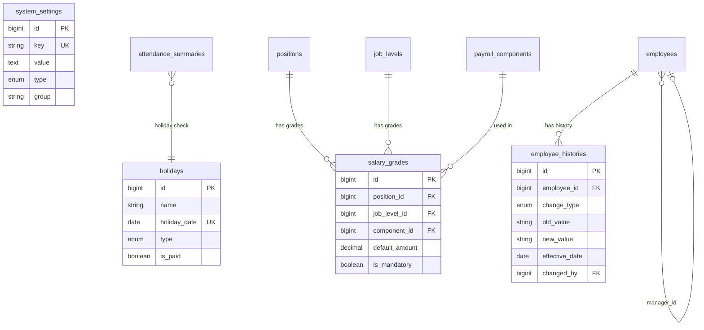

# 📋 Product Requirements Document (PRD)
# OrcaHR — HRIS Internal Admin System v2.0

> **Versi:** 2.0 | **Tanggal:** 13 Maret 2026 | **Status:** Draft
> **Tech Stack:** Laravel 12 + Inertia Vue 3 + MySQL
> **Sebelumnya:** PRD v1.1 → Sprint 1–5 selesai

---

## 1. Executive Summary

PRD ini adalah update dari v1.1 setelah Sprint 1–5 selesai. Semua modul MUST dari PRD v1.1 sudah diimplementasikan. PRD v2.0 mendokumentasikan **gap yang ditemukan saat review**, fitur yang kurang, dan roadmap untuk Sprint 6–8.

**Yang sudah ada (Sprint 1–5):**
- ✅ Core HR — Employee, Dept, Position, Job Level
- ✅ Attendance — Shift, Schedule, Clock-in/out (geoloc + selfie), Timesheet, Exception
- ✅ Leave — Type seeding, Balance, Request, Approval, Izin ½ Hari
- ✅ Payroll — Components (seeded), Config per Karyawan, Calculate, Approve, Slip, Export
- ✅ Dashboard — 4 stats cards, headcount chart, clock-in terbaru
- ✅ RBAC — Spatie role middleware (super-admin, hr, manager, employee)

---

## 2. Gap Analysis: v1.1 vs Kenyataan

| Area | Gap yang Ditemukan | Prioritas |
|------|--------------------|-----------|
| **Leave Types Master** | Tidak ada halaman CRUD UI. LeaveType hanya di-seed. HR tidak bisa tambah/edit via UI | 🔴 P0 |
| **Payroll Schema Builder** | Komponen gaji hanya CRUD biasa. Tidak ada builder untuk **struktur gaji per jabatan** (Position Salary Grade) | 🟠 P1 |
| **Holiday Calendar** | Tidak ada master hari libur nasional/perusahaan. Absensi tidak mempertimbangkan hari libur | 🔴 P0 |
| **Skema Gaji per Posisi** | Tidak ada konfigurasi "Engineer L2 → Gapok base Rp 8jt". Semua diinput manual per-karyawan | 🟠 P1 |
| **Payroll Tax (PPH21)** | PPH21 ada di seeder tapi tidak ada logika perhitungan aktual | 🟠 P1 |
| **Leave Accrual Job** | [MonthlyLeaveAccrual](file:///z:/project/orcahr/app/Jobs/MonthlyLeaveAccrual.php#15-71) Job belum dibuat. Saldo cuti tidak ter-update otomatis setiap bulan | 🔴 P0 |
| **Notifikasi In-App** | Tidak ada notifikasi ketika cuti di-approve/reject, payroll lunas, dll | 🟡 P2 |
| **Audit Log** | Tidak ada audit trail untuk perubahan data karyawan, approve payroll | 🟡 P2 |
| **Org Chart** | Tidak ada visualisasi struktur organisasi | 🟡 P2 |
| **Employee Documents** | KTP, NPWP scan, sertifikat — tidak bisa diupload | 🟡 P2 |
| **Employee Status History** | Tidak ada log riwayat perubahan jabatan/departemen/status | 🟠 P1 |
| **Attendance Office Config** | Koordinat kantor hardcoded di config. Tidak ada UI untuk ubah radius/lokasi | 🟠 P1 |
| **Multi-lokasi Kantor** | Hanya satu titik koordinat kantor | 🔵 P3 |
| **Leave Approval Flow** | Request bisa di-approve siapapun yang punya akses. Tidak ada approval chain | 🟠 P1 |
| **Rekap Kehadiran** | Tidak ada rekap bulanan per karyawan (present%, late%, absent%) | 🟠 P1 |

---

## 3. Prioritas MoSCoW v2.0

| Priority | Fitur | Sprint |
|----------|-------|--------|
| **MUST** | Holiday Calendar Master | Sprint 6 |
| **MUST** | Monthly Leave Accrual Job | Sprint 6 |
| **MUST** | Leave Types CRUD UI (review + fix) | Sprint 6 |
| **SHOULD** | Position Salary Grade (Skema Gaji per Jabatan) | Sprint 6 |
| **SHOULD** | Approval Chain Leave (Manager → HR) | Sprint 7 |
| **SHOULD** | Rekap Kehadiran per Karyawan | Sprint 7 |
| **SHOULD** | Attendance Office Location Config UI | Sprint 7 |
| **SHOULD** | Employee Status History / Riwayat Mutasi | Sprint 7 |
| **COULD** | Notifikasi In-App | Sprint 8 |
| **COULD** | Audit Log | Sprint 8 |
| **COULD** | Org Chart Visualisasi | Sprint 8 |
| **COULD** | Employee Document Upload | Sprint 8 |
| **WON'T** | Multi-lokasi Kantor | Backlog |
| **WON'T** | Email Slip Gaji | Backlog |

---

## 4. Fitur Baru — Spesifikasi Detail

---

### 4.1 Holiday Calendar (MUST — Sprint 6)

**Masalah:** Sistem tidak tahu hari libur nasional. Karyawan yang tidak masuk di hari libur dihitung "absent".

**Tabel Baru:**
```sql
CREATE TABLE holidays (
    id            BIGINT UNSIGNED AUTO_INCREMENT PRIMARY KEY,
    name          VARCHAR(100) NOT NULL,    -- "Hari Raya Idul Fitri"
    holiday_date  DATE NOT NULL UNIQUE,
    type          ENUM('national','company') DEFAULT 'national',
    is_paid       BOOLEAN DEFAULT TRUE,
    year          YEAR NOT NULL,
    created_at    TIMESTAMP,
    updated_at    TIMESTAMP
);
```

**Integrasi:**
- `ProcessAttendanceBatch` cek holiday sebelum set `status = absent`
- Jika hari libur → `status = holiday`, tidak hitung late/absent
- Dashboard: tampilkan hari libur bulan ini

**UI:** `/settings/holidays` — list per tahun + form tambah + import CSV

---

### 4.2 Monthly Leave Accrual Job (MUST — Sprint 6)

**Masalah:** Saldo cuti tidak pernah bertambah otomatis tiap bulan.

**Logic:**
```
Setiap tanggal 1:
  Untuk setiap karyawan aktif:
    Untuk setiap leave_type aktif:
      Jika masa_kerja >= min_service_months:
        Buat snapshot baru LeaveBalance:
          opening_balance = closing_balance bulan lalu
          accrued = accrual_rate_monthly
          closing_balance = min(opening + accrued, max_balance)
```

**Files:**
- `app/Console/Commands/AccrualLeaveBalances.php`
- Register schedule: `Schedule::command('leave:accrue')->monthlyOn(1, '00:05')`

---

### 4.3 Leave Types CRUD UI (MUST — Sprint 6)

**Masalah:** [Leave/Types/Index.vue](file:///z:/project/orcahr/resources/js/pages/Leave/Types/Index.vue) ada tapi perlu review apakah semua field tersedia (accrual_rate_monthly, max_carryover, min_service_months, is_paid).

**Action:** Audit LeaveTypeController dan View, tambah field yang kurang.

---

### 4.4 Position Salary Grade (SHOULD — Sprint 6)

**Masalah:** Tidak ada template gaji per jabatan/level. Semua diinput manual.

**Tabel Baru:**
```sql
CREATE TABLE salary_grades (
    id              BIGINT UNSIGNED AUTO_INCREMENT PRIMARY KEY,
    position_id     BIGINT UNSIGNED NULL REFERENCES positions(id),
    job_level_id    BIGINT UNSIGNED NULL REFERENCES job_levels(id),
    component_id    BIGINT UNSIGNED NOT NULL REFERENCES payroll_components(id),
    default_amount  DECIMAL(15,2) NOT NULL,
    is_mandatory    BOOLEAN DEFAULT FALSE,
    notes           VARCHAR(255) NULL,
    is_active       BOOLEAN DEFAULT TRUE,
    created_at      TIMESTAMP,
    updated_at      TIMESTAMP
);
```

**Workflow:**
1. HR buat grade di `/payroll/salary-grades`
2. Saat karyawan baru → auto-populate `employee_payroll_configs` dari grade matching
3. HR bisa override manual per karyawan

---

### 4.5 Approval Chain Leave (SHOULD — Sprint 7)

**Masalah:** Tidak ada aturan "karyawan harus di-approve manager dulu sebelum HR".

**Perubahan Database:**
```sql
ALTER TABLE employees 
  ADD COLUMN manager_id BIGINT UNSIGNED NULL REFERENCES employees(id);

ALTER TABLE leave_requests 
  ADD COLUMN manager_approval_status ENUM('pending','approved','rejected') DEFAULT 'pending',
  ADD COLUMN manager_approved_by BIGINT UNSIGNED NULL,
  ADD COLUMN manager_approved_at TIMESTAMP NULL;
```

**Flow Baru:**
```
Karyawan submit → pending
  ↓ Manager approve
manager_approval = approved
  ↓ HR approve
status = approved → saldo dipotong
```

---

### 4.6 Rekap Kehadiran per Karyawan (SHOULD — Sprint 7)

**Halaman:** `/attendance/recap`

**Data:**
- Filter: karyawan, departemen, bulan/tahun
- Per karyawan: hari hadir, terlambat, absent, cuti, libur, % kehadiran
- Total menit terlambat, total menit OT
- Export Excel

---

### 4.7 System Settings & Attendance Config (SHOULD — Sprint 7)

**Tabel Baru:**
```sql
CREATE TABLE system_settings (
    id      BIGINT UNSIGNED AUTO_INCREMENT PRIMARY KEY,
    key     VARCHAR(100) NOT NULL UNIQUE,
    value   TEXT NOT NULL,
    type    ENUM('string','integer','decimal','boolean','json') DEFAULT 'string',
    group   VARCHAR(50) NOT NULL DEFAULT 'general',
    label   VARCHAR(100) NOT NULL
);
```

**Settings default:**
| Key | Value | Label |
|-----|-------|-------|
| `attendance.office_latitude` | `-6.200000` | Latitude Kantor |
| `attendance.office_longitude` | `106.816666` | Longitude Kantor |
| `attendance.radius_meters` | `100` | Radius Absensi (meter) |
| `attendance.late_tolerance_minutes` | `15` | Toleransi Keterlambatan |
| `payroll.working_days_per_month` | `22` | Hari Kerja/Bulan Default |

**UI:** `/settings/system` — form per group

---

### 4.8 Employee Status History (SHOULD — Sprint 7)

**Tabel Baru:** `employee_histories`
```sql
CREATE TABLE employee_histories (
    id            BIGINT UNSIGNED AUTO_INCREMENT PRIMARY KEY,
    employee_id   BIGINT UNSIGNED NOT NULL,
    change_type   ENUM('department','position','job_level','status','salary'),
    old_value     VARCHAR(255) NULL,
    new_value     VARCHAR(255) NULL,
    effective_date DATE NOT NULL,
    notes         TEXT NULL,
    changed_by    BIGINT UNSIGNED NOT NULL,
    created_at    TIMESTAMP
);
```

**Auto-log:** Model Observer pada `Employee::updating()` → log perubahan department_id, position_id, employment_status.

---

## 5. ERD Additions (v2.0)



---

## 6. Roadmap Sprint 6–8

### Sprint 6 — Master Data & Automation (2 minggu)

| ID | Task | Effort |
|----|------|--------|
| S6-01 | Migration + Model `holidays` | Low |
| S6-02 | HolidayController + `Settings/Holidays/Index.vue` | Medium |
| S6-03 | Indonesia 2026 Holiday Seeder (16 hari libur) | Low |
| S6-04 | Integrasi Holiday → `ProcessAttendanceBatch` | Medium |
| S6-05 | `AccrualLeaveBalances` Artisan Command | Medium |
| S6-06 | Daftarkan di [routes/console.php](file:///z:/project/orcahr/routes/console.php) Schedule | Low |
| S6-07 | Audit LeaveType UI — tambah field yang kurang | Low |
| S6-08 | Migration + Model `salary_grades` | Low |
| S6-09 | SalaryGradeController + `Payroll/SalaryGrades/Index.vue` | Medium |
| S6-10 | Auto-populate employee_payroll_configs dari grade | Medium |

### Sprint 7 — Workflow & Analytics (2 minggu)

| ID | Task | Effort |
|----|------|--------|
| S7-01 | `manager_id` di employees + assign manager UI | Low |
| S7-02 | Leave approval chain migration + controller update | High |
| S7-03 | Manager notification saat ada leave baru | Medium |
| S7-04 | Rekap Kehadiran halaman + export Excel | Medium |
| S7-05 | Migration `system_settings` + seeder + CRUD UI | Medium |
| S7-06 | Ganti [config()](file:///z:/project/orcahr/app/Models/PayrollComponent.php#30-34) attendance → `SystemSetting::get()` | Medium |
| S7-07 | Migration `employee_histories` + Model Observer | Medium |
| S7-08 | Employee Show: tampilkan riwayat mutasi | Low |

### Sprint 8 — Polish & Advanced (1–2 minggu)

| ID | Task | Effort |
|----|------|--------|
| S8-01 | Laravel Notifications (database driver) + In-App bell | High |
| S8-02 | Audit Log via Model Observer + halaman log | Medium |
| S8-03 | Org Chart (CSS tree atau D3.js simple) | Medium |
| S8-04 | Employee Document Upload (Storage + index) | Medium |
| S8-05 | Mobile Responsive audit semua halaman | Medium |
| S8-06 | Error pages — 403, 404, 500 custom Inertia | Low |

---

## 7. Technical Debt Catalog

| # | Issue | Severity | Fix Sprint |
|---|-------|----------|------------|
| TD-01 | `LeaveRequest.cancel` refund pakai `now()->year` bukan year dari request | Low | Sprint 7 |
| TD-02 | Payroll absent deduction pakai component GAPOK (type=deduction) — membingungkan laporan | Medium | Sprint 6 |
| TD-03 | Office coordinate hardcoded di [config/attendance.php](file:///z:/project/orcahr/config/attendance.php) | Medium | Sprint 7 |
| TD-04 | PPH21 ada di komponen tapi tidak ada formula aktual | High | Sprint 7 |
| TD-05 | Queue worker (`php artisan queue:work`) belum di-setup di dokumentasi deploy | Medium | Sprint 6 |
| TD-06 | No pagination di Report/Slip — bisa lambat jika karyawan > 100 | Low | Sprint 7 |
| TD-07 | [DashboardController](file:///z:/project/orcahr/app/Http/Controllers/DashboardController.php#14-71) tidak menggunakan cache — query berat setiap page load | Low | Sprint 8 |

---

## 8. Review Status Final Sprint 1–5

### Controllers (20 files)

| Controller | Status | Notes |
|------------|--------|-------|
| [DashboardController](file:///z:/project/orcahr/app/Http/Controllers/DashboardController.php#14-71) | ✅ | 4 stats + clock-ins + headcount |
| [EmployeeController](file:///z:/project/orcahr/app/Http/Controllers/CoreHR/EmployeeController.php#15-78) | ✅ | Show method + all CRUD |
| `DepartmentController` | ✅ | |
| `PositionController` | ✅ | |
| `JobLevelController` | ✅ | |
| [AttendanceController](file:///z:/project/orcahr/app/Http/Controllers/Attendance/AttendanceController.php#14-104) | ✅ | Clock IN/OUT + selfie |
| `ScheduleController` | ✅ | Generate bulk |
| `ShiftController` | ✅ | |
| `TimesheetController` | ✅ | Export Excel |
| [ExceptionController](file:///z:/project/orcahr/app/Http/Controllers/Attendance/ExceptionController.php#15-104) | ✅ | Approve/Reject |
| [LeaveTypeController](file:///z:/project/orcahr/app/Http/Controllers/Leave/LeaveTypeController.php#10-66) | ⚠️ | Perlu audit field |
| [LeaveBalanceController](file:///z:/project/orcahr/app/Http/Controllers/Leave/LeaveBalanceController.php#12-61) | ✅ | |
| [LeaveRequestController](file:///z:/project/orcahr/app/Http/Controllers/Leave/LeaveRequestController.php#18-248) | ✅ | Full workflow |
| [PayrollComponentController](file:///z:/project/orcahr/app/Http/Controllers/Payroll/PayrollComponentController.php#10-66) | ✅ | |
| [EmployeePayrollConfigController](file:///z:/project/orcahr/app/Http/Controllers/Payroll/EmployeePayrollConfigController.php#12-60) | ✅ | |
| [PayrollController](file:///z:/project/orcahr/app/Http/Controllers/Payroll/PayrollController.php#18-362) | ✅ | Calculate + mySlip + Export |

### Vue Pages (37 files)

| Category | Count | Status |
|----------|-------|--------|
| Auth | 7 | ✅ (Fortify default) |
| Settings | 4 | ✅ (Fortify default) |
| Dashboard | 1 | ✅ Sprint 5 |
| Core HR | 7 | ✅ Sprint 1 |
| Attendance | 6 | ✅ Sprint 2 |
| Leave | 6 | ✅ Sprint 3 |
| Payroll | 5 | ✅ Sprint 4 |
| Welcome | 1 | ✅ |

### Database (21 migrations + 5 tabel baru di Sprint 6–8)

| Tables | Sprint |
|--------|--------|
| users, cache, jobs, permissions | Foundation |
| departments, job_levels, positions, employees | Sprint 1 |
| shift_masters, employee_schedules, raw_time_events, attendance_summaries, attendance_exceptions | Sprint 2 |
| leave_types, leave_balances, leave_requests | Sprint 3 |
| payroll_components, employee_payroll_configs, payroll_runs, payroll_details | Sprint 4 |
| **holidays, salary_grades** | Sprint 6 |
| **system_settings, employee_histories** | Sprint 7 |
| **notifications** (Laravel built-in) | Sprint 8 |
